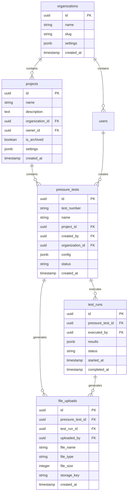

# Pressograph 2.0: Pages Structure and Functionality

**Version:** 2.0.0
**Date:** 2025-11-06
**Status:** Final Design Decision
**Author:** Development Team

## Executive Summary

After analyzing the old v1.0 History page functionality and comparing it with the planned v2.0 architecture, we have determined that **the `/history` route is functionally replaced by the combination of `/tests` and `/projects` pages**. However, the v2.0 architecture introduces a more sophisticated, project-oriented workflow that significantly enhances the original capabilities.

### Key Decision

**The `/dashboard`, `/projects`, and `/tests` pages form a three-tier architecture that not only replaces `/history` but also adds substantial new functionality:**

1. **`/dashboard`** - High-level overview and quick access
2. **`/projects`** - Project-centric management and organization
3. **`/tests`** - Comprehensive test and graph history (replaces old `/history`)

This structure aligns with modern SaaS patterns and the new database schema that supports multi-tenancy, organizations, and project-based workflows.

---

## Historical Context (v1.0)

### Pages in v1.0

The old Pressograph v1.0 (Vite + React) had a simpler, flat structure:

| Route | Purpose | Lines of Code | Status |
|-------|---------|---------------|--------|
| `/` | Landing page with test creation form | ~300 | Basic |
| `/history` | Complete test history and graph management | 1,224 | Full-featured |
| `/admin` | Admin dashboard (stub) | 66 | Placeholder |
| `/profile` | User profile settings | ~200 | Basic |
| `/help` | Documentation and help | 23KB | Complete |
| `/login` | Authentication | ~150 | Basic |
| `/setup` | Initial setup wizard | ~400 | Full |
| `/share/:token` | Public graph sharing | ~100 | Basic |

### Key Functionality in v1.0

**The `/history` page was the core of v1.0**, providing:

1. **Comprehensive Table View**
   - Paginated list (20 items per page)
   - Columns: ID, Test Number, Format, File Size, Creation Date, Comment, Status, Actions
   - Responsive design with dark mode

2. **Search and Filtering**
   - Full-text search across test numbers and comments
   - Filter by export format (PNG, PDF, JSON)
   - Sort by date (newest/oldest) or test number

3. **Per-Graph Actions**
   - View details in modal
   - Download original file
   - Download settings as JSON
   - Regenerate with different format/theme
   - Create public share link
   - Delete graph (with confirmation)
   - Edit/add comments

4. **Modals and Interactions**
   - Preview modal showing all metadata and test parameters
   - Regenerate modal with format/theme selection
   - Delete confirmation dialog
   - Inline comment editing

### What v1.0 Lacked

- **No project organization** - all tests in one flat list
- **No multi-tenancy** - single organization only
- **No separation between test definitions and executions**
- **Limited analytics** - no usage statistics or insights
- **Basic sharing** - simple token-based links without expiration
- **No batch operations** - actions only on individual graphs

---

## v2.0 Architecture Decision

### Rationale

The v2.0 architecture introduces a **hierarchical, project-oriented structure** that addresses the limitations of v1.0 while preserving all its core functionality:

**Why Three Pages Instead of One `/history`?**

1. **Separation of Concerns**
   - Dashboard: Quick overview and navigation hub
   - Projects: Organizational structure and project management
   - Tests: Detailed test history and graph management (replaces old `/history`)

2. **Database Schema Alignment**
   ```
   Organizations (multi-tenancy)
     ↓
   Projects (grouping mechanism)
     ↓
   Pressure Tests (test configurations)
     ↓
   Test Runs (actual executions)
     ↓
   File Uploads (generated graphs: PNG, PDF)
   ```

3. **User Experience**
   - Users can navigate hierarchically: Dashboard → Projects → Tests → Test Runs
   - Global view: See all tests across all projects (`/tests`)
   - Project-scoped view: See tests within a specific project (`/projects/[id]/tests`)

4. **Scalability**
   - Supports organizations with hundreds of projects
   - Efficient filtering and pagination at each level
   - Clear data ownership and access control

### Trade-offs

**What We Gain:**
- Project-based organization
- Multi-tenancy support
- Separation of test definitions from executions
- Better scalability for large datasets
- Enhanced analytics and reporting
- Batch operations on multiple tests
- Advanced sharing with expiration dates

**What We Preserve from v1.0:**
- All search and filter capabilities (now in `/tests`)
- All per-graph actions (view, download, regenerate, share, delete)
- Comment editing
- Modal previews
- Status indicators
- Empty state handling

**What Changes:**
- URL structure: `/history` → `/tests` (or `/projects/[id]/tests`)
- Additional layer: Must navigate through projects (or use global `/tests` view)
- More complex but more powerful

---

## Page Definitions (v2.0)

### `/dashboard`

**Purpose:** Primary landing page after authentication. Provides quick overview and navigation hub.

**Features:**
- **Overview Statistics Cards**
  - Total projects count
  - Active tests count
  - Recent test runs
  - Storage usage

- **Recent Activity Feed**
  - Latest test runs
  - Recently created tests
  - Recent graph generations
  - Team activity (if multi-user)

- **Quick Actions**
  - Create new test
  - Generate graph from existing test
  - Access recent projects
  - View system notifications

- **Navigation Sidebar**
  - Link to all main pages
  - Project favorites
  - User profile dropdown
  - Theme toggle

- **Widgets**
  - Test success rate chart (last 30 days)
  - Most used projects
  - Storage usage graph
  - Upcoming test expirations

**User Stories:**
- As a user, I can see an overview of all my activity at a glance
- As a user, I can quickly navigate to any section of the application
- As a user, I can see my most important notifications and alerts
- As a user, I can access frequently used projects quickly
- As a manager, I can see team activity and overall statistics

**Database Queries:**
```typescript
// Dashboard statistics
- SELECT COUNT(*) FROM projects WHERE owner_id = ?
- SELECT COUNT(*) FROM pressure_tests WHERE created_by = ? AND status = 'running'
- SELECT * FROM test_runs ORDER BY created_at DESC LIMIT 10
- SELECT SUM(file_size) FROM file_uploads WHERE uploaded_by = ?
```

**Technical Implementation:**
- Server Component for initial data
- Client Component for interactive widgets
- TanStack Query for real-time updates
- Recharts/Chart.js for data visualization
- Skeleton loading states

---

### `/projects`

**Purpose:** Project management and organization. Groups related pressure tests together.

**Features:**
- **Project List View**
  - Card or table view of all projects
  - Search by project name/description
  - Filter by status (active/archived)
  - Sort by date created, name, test count

- **Project Cards Display**
  - Project name and description
  - Owner and creation date
  - Test count badge
  - Quick actions dropdown
  - Archive/unarchive toggle

- **Project CRUD Operations**
  - Create new project (modal form)
  - Edit project details (name, description, settings)
  - Archive project (soft delete)
  - Delete project (hard delete with confirmation)
  - Duplicate project (copy settings)

- **Project Settings**
  - Auto-number tests (enable/disable)
  - Test number prefix (e.g., "PT-2025-")
  - Require notes on test creation
  - Default template type

- **Navigation to Tests**
  - Click project card → `/projects/[id]` (project detail page)
  - Project detail page shows all tests for that project
  - Breadcrumb navigation

**User Stories:**
- As a user, I can create projects to organize related tests
- As a user, I can see all my projects in one view
- As a user, I can search and filter projects
- As a user, I can configure project-specific settings
- As a user, I can archive completed projects
- As a manager, I can assign ownership of projects
- As a user, I can see how many tests each project contains

**Database Schema:**
```typescript
// projects table
{
  id: uuid,
  name: varchar(255),
  description: text,
  organizationId: uuid,
  ownerId: uuid,
  isArchived: boolean,
  settings: {
    autoNumberTests: boolean,
    testNumberPrefix: string,
    requireNotes: boolean,
    defaultTemplateType: string
  },
  createdAt: timestamp,
  updatedAt: timestamp
}
```

**Page Sections:**
1. Header with search and "New Project" button
2. Filter sidebar (status, owner, date range)
3. Project cards/table grid
4. Pagination controls
5. Empty state (no projects)

**Technical Implementation:**
- Server Component for project list
- Client Component for search/filter
- Server Actions for CRUD operations
- Optimistic updates with TanStack Query
- shadcn/ui Card, Dialog, DropdownMenu components

---

### `/tests` (Replaces `/history`)

**Purpose:** Comprehensive test and graph history management. This is the spiritual successor to the old `/history` page, with enhanced capabilities.

**Two Access Patterns:**

1. **Global View:** `/tests` - All tests across all projects
2. **Project-Scoped View:** `/projects/[id]/tests` - Tests within a specific project

**Features:**

#### 1. Table View (Enhanced from v1.0)
- **Columns:**
  - Test Number (e.g., "PT-2025-001")
  - Test Name
  - Project (new in v2.0)
  - Status (draft/ready/running/completed/failed/cancelled)
  - Last Run Date
  - Run Count
  - Graph Format (PNG/PDF)
  - File Size
  - Actions

- **Pagination:**
  - Configurable items per page (10, 20, 50, 100)
  - Server-side pagination for performance
  - Total count display

#### 2. Search and Filtering (Enhanced)
- **Search Fields:**
  - Test number
  - Test name
  - Description
  - Tags
  - Comments

- **Filters:**
  - By project (dropdown)
  - By status (multi-select)
  - By date range (date picker)
  - By graph format (PNG/PDF/JSON)
  - By template type (daily/extended/custom)
  - By tags (multi-select)

- **Sort Options:**
  - Newest first (default)
  - Oldest first
  - By test number
  - By name (A-Z)
  - By last run date
  - By run count

#### 3. Per-Test Actions (Preserved from v1.0 + Enhanced)

**Dropdown Menu Actions:**

- **View Details** → Opens preview modal
  - Test configuration (pressure, temperature, duration)
  - All test runs history
  - Latest graph preview (if available)
  - Test parameters and settings
  - Tags and metadata
  - Sharing status

- **View Runs** → Navigate to `/tests/[id]/runs`
  - List all executions of this test
  - Time-series measurements
  - Pass/fail status
  - Duration and operator

- **Download Graph** → Download latest generated graph
  - PNG or PDF file
  - Original quality
  - Filename with test number and timestamp

- **Download JSON** → Export test configuration
  - Complete test settings
  - Intermediate stages
  - Metadata and notes

- **Regenerate Graph** → Opens regenerate modal
  - Select format (PNG, PDF, JSON)
  - Choose theme (light, dark)
  - Configure quality (scale, width, height)
  - Download automatically after generation
  - Shows generation progress

- **Create Share Link** → Generate public access link
  - Set expiration date (1 day, 7 days, 30 days, never)
  - Allow/disallow downloads
  - Copy link to clipboard
  - QR code generation (new in v2.0)
  - View share analytics (new in v2.0)

- **Edit Test** → Navigate to test edit form
  - Update test configuration
  - Modify parameters
  - Change project assignment
  - Update tags

- **Run Test** → Execute test (if status = 'ready')
  - Start new test run
  - Track in real-time (new in v2.0)
  - Generate graph automatically

- **Duplicate Test** → Create copy
  - Copy all settings
  - Assign new test number
  - Reset status to 'draft'

- **Delete Test** → Remove test (with confirmation)
  - Shows warning if test has runs
  - Cascade delete runs and graphs
  - Audit log entry

#### 4. Preview Modal (Enhanced)
```
┌──────────────────────────────────────────────┐
│  Test Details: PT-2025-001                  │
├──────────────────────────────────────────────┤
│  [Test Info Tab] [Runs Tab] [Graphs Tab]    │
│                                               │
│  Test Number: PT-2025-001                    │
│  Name: Daily Pressure Test - Pipeline A      │
│  Project: Pipeline Commissioning 2025        │
│  Status: ✅ Completed                        │
│  Created: 2025-11-01 14:23                   │
│  Created By: John Doe                        │
│                                               │
│  Configuration:                               │
│  - Working Pressure: 10 MPa                  │
│  - Max Pressure: 15 MPa                      │
│  - Test Duration: 24 hours                   │
│  - Temperature: 20°C                         │
│  - Allowable Drop: 0.5 MPa                   │
│                                               │
│  Intermediate Stages: 2                      │
│  1. 60 min → 5 MPa (hold 30 min)            │
│  2. 120 min → 10 MPa (hold 60 min)          │
│                                               │
│  Tags: [pipeline] [commissioning] [daily]    │
│                                               │
│  Description:                                │
│  Daily pressure test for main pipeline...    │
│                                               │
│  [Edit Comment]  [Download]  [Share]  [Run] │
└──────────────────────────────────────────────┘
```

#### 5. Comment System (Preserved from v1.0)
- Add comments to tests
- Edit existing comments
- Markdown support (new in v2.0)
- Mentions (@username) support (new in v2.0)
- Comment history (new in v2.0)

#### 6. Batch Operations (New in v2.0)
- Select multiple tests (checkboxes)
- Batch actions:
  - Download all graphs as ZIP
  - Export all as CSV
  - Delete multiple tests
  - Change project assignment
  - Add tags to multiple tests
  - Generate graphs for multiple tests

#### 7. Status Indicators
- **Draft** (gray) - Test created but not ready
- **Ready** (blue) - Test configured and ready to run
- **Running** (yellow, animated) - Test in progress
- **Completed** (green) - Test passed successfully
- **Failed** (red) - Test failed
- **Cancelled** (orange) - Test manually cancelled

#### 8. Empty States
- **No tests yet:**
  ```
  📊 No Tests Yet
  Create your first pressure test to get started
  [Create Test] button
  ```

- **No search results:**
  ```
  🔍 No Results Found
  Try adjusting your filters or search query
  [Clear Filters] button
  ```

- **No tests in project:**
  ```
  📂 This Project Has No Tests
  Add a test to this project to begin
  [Add Test] button
  ```

**User Stories:**
- As a user, I can see all my tests across all projects in one place
- As a user, I can filter tests to show only those in a specific project
- As a user, I can search for tests by number, name, or tags
- As a user, I can download graphs I've generated
- As a user, I can regenerate graphs with different formats or themes
- As a user, I can share test results with external stakeholders
- As a user, I can see the complete history of all test runs
- As a user, I can edit test configurations after creation
- As a user, I can duplicate tests to save time
- As a user, I can delete tests I no longer need
- As a manager, I can see tests across multiple projects
- As a manager, I can perform batch operations on multiple tests

**Database Queries:**
```typescript
// Get all tests with pagination and filters
SELECT
  pt.id, pt.test_number, pt.name, pt.status,
  pt.created_at, pt.updated_at,
  p.name as project_name,
  u.name as created_by_name,
  COUNT(tr.id) as run_count,
  MAX(tr.completed_at) as last_run_date,
  (SELECT fu.file_type FROM file_uploads fu
   WHERE fu.pressure_test_id = pt.id
   ORDER BY fu.created_at DESC LIMIT 1) as latest_graph_format,
  (SELECT fu.file_size FROM file_uploads fu
   WHERE fu.pressure_test_id = pt.id
   ORDER BY fu.created_at DESC LIMIT 1) as latest_graph_size
FROM pressure_tests pt
LEFT JOIN projects p ON pt.project_id = p.id
LEFT JOIN users u ON pt.created_by = u.id
LEFT JOIN test_runs tr ON tr.pressure_test_id = pt.id
WHERE pt.organization_id = ?
  AND (? IS NULL OR pt.project_id = ?) -- project filter
  AND (? IS NULL OR pt.status = ?) -- status filter
  AND (? IS NULL OR pt.test_number ILIKE ?) -- search
GROUP BY pt.id, p.name, u.name
ORDER BY pt.created_at DESC
LIMIT ? OFFSET ?
```

**Technical Implementation:**
- Server Component for table rendering
- Server Actions for mutations (delete, update)
- Client Component for search/filter
- TanStack Query for data fetching
- shadcn/ui Table, Dialog, DropdownMenu, Command
- React Hook Form + Zod for form validation
- Optimistic updates for better UX

---

## Functional Comparison Matrix

| Feature | v1.0 `/history` | v2.0 `/dashboard` | v2.0 `/projects` | v2.0 `/tests` |
|---------|----------------|-------------------|------------------|---------------|
| **List all tests** | ✅ Flat list | ❌ No | ❌ Project-scoped only | ✅ Global + scoped |
| **View test details** | ✅ Modal | ❌ No | ❌ No | ✅ Enhanced modal |
| **Download graphs** | ✅ Individual | ❌ No | ❌ No | ✅ Individual + batch |
| **Share links** | ✅ Basic | ❌ No | ❌ No | ✅ Enhanced with expiry |
| **Delete tests** | ✅ Individual | ❌ No | ❌ No | ✅ Individual + batch |
| **Edit comments** | ✅ Plain text | ❌ No | ❌ No | ✅ Markdown support |
| **Filter by project** | ❌ No concept | ❌ No | ✅ Implicit | ✅ Explicit filter |
| **Project management** | ❌ No | ❌ Quick view | ✅ Full CRUD | ❌ No |
| **Dashboard widgets** | ❌ No | ✅ Statistics | ❌ No | ❌ No |
| **Search tests** | ✅ Basic | ❌ No | ✅ Project-scoped | ✅ Global search |
| **Sort options** | ✅ 3 options | ❌ No | ✅ Multiple | ✅ 6+ options |
| **Pagination** | ✅ 20/page | ❌ No | ✅ Configurable | ✅ Configurable |
| **Regenerate graphs** | ✅ Format+theme | ❌ No | ❌ No | ✅ Enhanced |
| **Status indicators** | ✅ 3 statuses | ✅ Summary | ✅ Per project | ✅ 6 statuses |
| **Empty states** | ✅ Basic | ✅ Onboarding | ✅ Project-specific | ✅ Context-aware |
| **View test runs** | ❌ No | ❌ No | ❌ No | ✅ New feature |
| **Duplicate tests** | ❌ No | ❌ No | ❌ No | ✅ New feature |
| **Edit test config** | ❌ No | ❌ No | ❌ No | ✅ New feature |
| **Tags support** | ❌ No | ❌ No | ❌ No | ✅ New feature |
| **Batch operations** | ❌ No | ❌ No | ❌ No | ✅ New feature |
| **QR code sharing** | ❌ No | ❌ No | ❌ No | ✅ New feature |
| **Share analytics** | ❌ No | ✅ Summary | ❌ No | ✅ Per-test |
| **Activity feed** | ❌ No | ✅ Yes | ❌ No | ❌ No |
| **Quick actions** | ❌ No | ✅ Yes | ✅ Per project | ✅ Per test |

**Summary:**
- **Dashboard** = New functionality (overview, navigation)
- **Projects** = New functionality (organization, grouping)
- **Tests** = Replaces `/history` + significant enhancements

---

## User Journey Mapping

### Scenario 1: View All My Tests

**v1.0 Journey:**
1. User logs in
2. User clicks "History" in navigation
3. User sees all tests in one flat list
4. Done (2 clicks)

**v2.0 Journey (Global View):**
1. User logs in → lands on `/dashboard`
2. User clicks "Tests" in sidebar
3. User sees all tests across all projects
4. Done (2 clicks)

**v2.0 Journey (Project View):**
1. User logs in → lands on `/dashboard`
2. User clicks "Projects" in sidebar
3. User clicks on specific project card
4. User sees all tests in that project
5. Done (3 clicks)

**Analysis:** Global view has same efficiency as v1.0. Project view adds one click but provides better organization.

---

### Scenario 2: Download a Graph

**v1.0 Journey:**
1. User navigates to `/history`
2. User finds test in table
3. User clicks Actions dropdown
4. User clicks "Download"
5. File downloads (4 clicks)

**v2.0 Journey:**
1. User navigates to `/tests`
2. User finds test in table (or uses search)
3. User clicks Actions dropdown
4. User clicks "Download Graph"
5. File downloads (4 clicks)

**Analysis:** Same number of clicks. v2.0 adds better search to find tests faster.

---

### Scenario 3: Organize Tests by Project

**v1.0 Journey:**
- ❌ Not possible - no project concept

**v2.0 Journey:**
1. User navigates to `/projects`
2. User clicks "New Project"
3. User fills in project details (name, description, settings)
4. User clicks "Create"
5. User navigates to `/tests`
6. User clicks on test to edit
7. User changes "Project" dropdown
8. User saves (8 clicks)

**OR (During test creation):**
1. User creates new test
2. User selects project from dropdown during creation
3. Done (part of normal workflow)

**Analysis:** New capability in v2.0. Adds organizational power.

---

### Scenario 4: See Overall Statistics

**v1.0 Journey:**
- ❌ Not available - no dashboard or statistics

**v2.0 Journey:**
1. User logs in → lands on `/dashboard`
2. User sees statistics immediately:
   - Total projects
   - Active tests
   - Recent runs
   - Storage usage
3. Done (1 click - login)

**Analysis:** Significant new capability in v2.0.

---

### Scenario 5: Manage Projects (Create, Edit, Archive)

**v1.0 Journey:**
- ❌ Not possible - no project concept

**v2.0 Journey (Create Project):**
1. User navigates to `/projects`
2. User clicks "New Project"
3. User fills form
4. User clicks "Create"
5. Done (4 clicks)

**v2.0 Journey (Edit Project):**
1. User navigates to `/projects`
2. User clicks Actions dropdown on project card
3. User clicks "Edit"
4. User modifies settings
5. User clicks "Save"
6. Done (5 clicks)

**v2.0 Journey (Archive Project):**
1. User navigates to `/projects`
2. User clicks Actions dropdown on project card
3. User clicks "Archive"
4. User confirms
5. Done (4 clicks)

**Analysis:** Entirely new functionality in v2.0.

---

### Scenario 6: Share a Test Result with External Stakeholder

**v1.0 Journey:**
1. User navigates to `/history`
2. User finds test
3. User clicks Actions → "Share"
4. System generates token link
5. User copies link to clipboard
6. User sends link via email/chat
7. Recipient opens `/share/:token` (no login required)
8. Recipient views graph (7 clicks total)

**v2.0 Journey:**
1. User navigates to `/tests`
2. User finds test (with better search)
3. User clicks Actions → "Create Share Link"
4. User sets expiration date (new feature)
5. User enables/disables download permission (new feature)
6. System generates link + QR code (new feature)
7. User copies link OR shares QR code
8. User sends to recipient
9. Recipient opens `/share/:token` (no login required)
10. Recipient views graph and can download if allowed
11. User can later view share analytics (views, downloads) (new feature)

**Analysis:** More clicks but significantly more powerful. Adds security (expiration), control (download permissions), and insights (analytics).

---

### Scenario 7: Regenerate a Graph with Different Format

**v1.0 Journey:**
1. User navigates to `/history`
2. User finds test
3. User clicks Actions → "Regenerate"
4. Modal opens
5. User selects format (PNG/PDF/JSON)
6. User selects theme (light/dark) if PNG/PDF
7. User clicks "Regenerate"
8. System generates graph (loading indicator)
9. Graph downloads automatically
10. Done (9 clicks)

**v2.0 Journey:**
1. User navigates to `/tests`
2. User finds test
3. User clicks Actions → "Regenerate Graph"
4. Modal opens
5. User selects format (PNG/PDF/JSON)
6. User selects theme (light/dark) if PNG/PDF
7. User adjusts quality settings (scale, dimensions) - new options
8. User clicks "Regenerate"
9. System generates graph (progress bar - enhanced)
10. Graph downloads automatically
11. Graph is also saved to test runs (new - persistence)
12. Done (11 clicks)

**Analysis:** Similar flow, enhanced with better progress indication, quality controls, and automatic persistence.

---

### Scenario 8: Find Tests from Last Month

**v1.0 Journey:**
1. User navigates to `/history`
2. User scrolls through paginated list
3. User manually checks dates
4. (No built-in date filter)

**v2.0 Journey:**
1. User navigates to `/tests`
2. User opens filter sidebar
3. User selects date range picker
4. User sets range: 2025-10-01 to 2025-10-31
5. User clicks "Apply Filter"
6. Table updates to show only matching tests
7. Done (6 clicks)

**Analysis:** Significant improvement in v2.0 with dedicated date range filtering.

---

## Recommended Page Structure

Based on the analysis above, here is the final recommended structure:

### Primary Navigation

```
📊 Dashboard         [/dashboard]           - Landing page, overview
📁 Projects          [/projects]            - Project management
🧪 Tests             [/tests]               - Test history (replaces /history)
👤 Profile           [/profile]             - User settings
⚙️  Admin            [/admin]               - Admin dashboard (admin only)
📚 Help              [/help or /docs]       - Documentation
```

### Page Hierarchy

```
Dashboard (/dashboard)
├── Quick stats widgets
├── Recent activity feed
├── Quick actions
└── Navigation to all sections

Projects (/projects)
├── All projects list/grid
├── Create new project
├── Project detail (/projects/[id])
│   ├── Project settings
│   ├── Project tests (/projects/[id]/tests) - scoped view
│   └── Project analytics
└── Archive

Tests (/tests) ← REPLACES /history
├── Global test list (all projects)
├── Search and filters
│   ├── Filter by project
│   ├── Filter by status
│   ├── Filter by date range
│   └── Filter by tags
├── Test detail modal
├── Test runs (/tests/[id]/runs)
└── Per-test actions
    ├── View details
    ├── Download graph
    ├── Regenerate graph
    ├── Share link
    ├── Edit test
    ├── Run test
    ├── Duplicate test
    └── Delete test

Profile (/profile)
├── User information
├── Preferences
├── Security settings
└── Activity log

Admin (/admin)
├── User management
├── System statistics
├── Analytics
└── System health
```

### URL Examples

```
/dashboard                          - Main dashboard
/projects                           - All projects
/projects/123e4567                  - Specific project
/projects/123e4567/tests            - Tests in project (scoped view)
/tests                              - All tests (global view) ← REPLACES /history
/tests?project=123e4567             - Tests filtered by project
/tests?status=running               - Tests filtered by status
/tests?search=pipeline              - Tests search results
/tests/abc123/runs                  - All runs of a specific test
/tests/abc123/runs/def456           - Specific test run detail
/profile                            - User profile
/admin                              - Admin dashboard
/share/token123                     - Public share link (no auth)
```

---

## Implementation Roadmap

### Sprint 2 (2025-11-17 to 2025-12-01) - Foundation

**Priority: Dashboard + Core UI**

1. **Dashboard Page** (4 SP)
   - Layout with sidebar navigation
   - Statistics cards (counts)
   - Recent activity feed (latest 10 items)
   - Quick action buttons

2. **Navigation Component** (3 SP)
   - Sidebar with icons
   - Active state highlighting
   - Mobile responsive drawer
   - User profile dropdown

3. **Core UI Components** (10 SP)
   - Table component (for tests list)
   - Modal/Dialog component
   - Dropdown menu component
   - Form components (inputs, selects)
   - Card component

**Total: 17 SP (fits in Sprint 2 capacity of 40 SP)**

---

### Sprint 3 (2025-12-02 to 2025-12-15) - Projects + Tests Backend

**Priority: Projects Management + Tests API**

1. **Projects Page** (13 SP)
   - Project list/grid view (5 SP)
   - Create project modal (3 SP)
   - Edit project modal (2 SP)
   - Delete/archive project (2 SP)
   - Project settings (1 SP)

2. **Tests Backend API** (13 SP)
   - List tests endpoint with filters (5 SP)
   - Get test detail endpoint (2 SP)
   - Create/update test endpoints (3 SP)
   - Delete test endpoint (1 SP)
   - Search tests endpoint (2 SP)

3. **File Upload API** (5 SP)
   - Upload graph file endpoint (2 SP)
   - Download graph endpoint (2 SP)
   - Delete file endpoint (1 SP)

**Total: 31 SP**

---

### Sprint 4 (2025-12-16 to 2025-12-29) - Tests Page (History Replacement)

**Priority: Complete /tests page to replace /history**

1. **Tests List Page** (13 SP)
   - Table view with all columns (5 SP)
   - Pagination (2 SP)
   - Search and filter sidebar (4 SP)
   - Empty states (1 SP)
   - Batch selection (1 SP)

2. **Test Actions** (13 SP)
   - Preview modal (3 SP)
   - Download graph action (2 SP)
   - Regenerate graph modal (4 SP)
   - Share link modal (3 SP)
   - Delete confirmation (1 SP)

3. **Test Runs** (8 SP)
   - Test runs list page (4 SP)
   - Run detail page (3 SP)
   - Run test action (1 SP)

**Total: 34 SP**

---

### Sprint 5 (2025-12-30 to 2026-01-12) - Enhancements

**Priority: Advanced features and testing**

1. **Advanced Tests Features** (10 SP)
   - Duplicate test (2 SP)
   - Edit test configuration (3 SP)
   - Tags system (3 SP)
   - Comment system with Markdown (2 SP)

2. **Batch Operations** (8 SP)
   - Batch download as ZIP (3 SP)
   - Batch delete (2 SP)
   - Batch tag assignment (2 SP)
   - Export to CSV (1 SP)

3. **Testing** (15 SP)
   - Unit tests for services (8 SP)
   - Integration tests for API (5 SP)
   - E2E tests for critical paths (2 SP)

**Total: 33 SP**

---

### Sprint 6 (2026-01-13 to 2026-01-26) - Polish + Documentation

**Priority: CI/CD, analytics, and documentation**

1. **Analytics & Insights** (8 SP)
   - Share analytics (views, downloads) (3 SP)
   - Dashboard charts (test success rate) (3 SP)
   - Project statistics (2 SP)

2. **CI/CD Pipeline** (13 SP)
   - GitHub Actions setup (5 SP)
   - Automated testing (5 SP)
   - Automated deployments (3 SP)

3. **Documentation** (10 SP)
   - User guide (5 SP)
   - API documentation (3 SP)
   - Video tutorials (2 SP)

**Total: 31 SP**

---

## Migration Notes

### From v1.0 `/history` to v2.0 `/tests`

**Data Migration:**

Old v1.0 database schema (simplified):
```sql
graphs {
  id: integer
  test_number: varchar
  export_format: varchar  -- 'png' | 'pdf' | 'json'
  file_path: varchar
  file_size: integer
  generation_time_ms: integer
  status: varchar  -- 'success' | 'failed' | 'pending'
  comment: text
  settings: jsonb  -- test parameters
  created_at: timestamp
}
```

New v2.0 database schema:
```sql
pressure_tests {
  id: uuid
  test_number: varchar
  name: varchar
  project_id: uuid  -- NEW: belongs to project
  config: jsonb  -- test parameters (renamed from settings)
  status: varchar  -- expanded statuses
  created_by: uuid  -- NEW: user tracking
  organization_id: uuid  -- NEW: multi-tenancy
  created_at: timestamp
}

test_runs {
  id: uuid
  pressure_test_id: uuid
  executed_by: uuid
  results: jsonb  -- measurement data
  status: varchar
  started_at: timestamp
  completed_at: timestamp
}

file_uploads {
  id: uuid
  pressure_test_id: uuid  -- links to test
  test_run_id: uuid  -- links to specific run
  file_name: varchar
  file_type: varchar  -- MIME type
  file_size: integer
  storage_key: varchar  -- S3 key or file path
  created_at: timestamp
}
```

**Migration Script Pseudocode:**

```typescript
// Migrate v1.0 graphs to v2.0 schema
async function migrateV1ToV2() {
  // 1. Create default organization
  const org = await createOrganization({
    name: "Default Organization",
    slug: "default"
  });

  // 2. Create default project
  const defaultProject = await createProject({
    name: "Migrated Tests",
    description: "Tests migrated from v1.0",
    organizationId: org.id,
    ownerId: defaultAdminUser.id
  });

  // 3. Migrate each graph
  for (const graph of oldGraphs) {
    // Create pressure test
    const test = await createPressureTest({
      testNumber: graph.test_number,
      name: `Test ${graph.test_number}`,
      projectId: defaultProject.id,
      organizationId: org.id,
      createdBy: defaultAdminUser.id,
      config: graph.settings,  // settings → config
      status: mapOldStatus(graph.status),  // 'success' → 'completed'
      createdAt: graph.created_at
    });

    // Create test run (representing the graph generation)
    const run = await createTestRun({
      pressureTestId: test.id,
      executedBy: defaultAdminUser.id,
      status: 'completed',
      startedAt: graph.created_at,
      completedAt: graph.created_at,
      results: {
        measurements: [],  // No measurements in v1.0
        finalPressure: graph.settings.workingPressure,
        pressureDrop: 0,
        passed: graph.status === 'success',
        notes: graph.comment || ''
      }
    });

    // Create file upload record (if graph file exists)
    if (graph.file_path && fileExists(graph.file_path)) {
      await createFileUpload({
        pressureTestId: test.id,
        testRunId: run.id,
        uploadedBy: defaultAdminUser.id,
        organizationId: org.id,
        fileName: path.basename(graph.file_path),
        fileType: `image/${graph.export_format}`,
        fileSize: graph.file_size,
        storageKey: graph.file_path,
        storageProvider: 'local',
        createdAt: graph.created_at
      });
    }
  }
}

function mapOldStatus(oldStatus: string): string {
  switch (oldStatus) {
    case 'success': return 'completed';
    case 'failed': return 'failed';
    case 'pending': return 'running';
    default: return 'draft';
  }
}
```

**Functionality Preserved:**
- All test numbers and data
- All generated graphs (PNG, PDF)
- All test settings and parameters
- All comments and metadata
- All timestamps

**Functionality Enhanced:**
- Tests now belong to projects
- Tests can have multiple runs
- Better status tracking
- User attribution
- Multi-tenancy support

---

## Open Questions

### 1. Should `/tests` and `/history` be aliases?

**Question:** Should we keep the old `/history` route as an alias that redirects to `/tests` for backward compatibility?

**Options:**
- **Option A:** Hard redirect `/history` → `/tests` (user sees URL change)
- **Option B:** Soft redirect (URL stays `/history` but renders `/tests` page)
- **Option C:** No redirect, remove `/history` entirely (breaking change)

**Recommendation:** Option A - Hard redirect with informational toast
```typescript
// /app/history/page.tsx
export default function HistoryRedirect() {
  redirect('/tests');
}
```

---

### 2. Should project-specific tests be shown in `/projects/[id]` or `/tests?project=[id]`?

**Question:** When viewing tests for a specific project, should users navigate to a dedicated project detail page or use filters on the global tests page?

**Options:**
- **Option A:** Both approaches (dual navigation paths)
  - `/projects/[id]/tests` - Dedicated page (clean URL)
  - `/tests?project=[id]` - Filtered view (shareable link)
- **Option B:** Only dedicated page `/projects/[id]/tests`
- **Option C:** Only filtered view `/tests?project=[id]`

**Recommendation:** Option A - Both approaches for flexibility

**Rationale:**
- Dedicated page (`/projects/[id]/tests`) is better for hierarchical navigation
- Filtered view (`/tests?project=[id]`) is better for bookmarking and sharing
- Both use the same underlying component/API

---

### 3. How to handle global vs project-scoped views?

**Question:** Should the `/tests` page always show all tests across all projects, or should it remember the last selected project filter?

**Options:**
- **Option A:** Always global view by default, user can filter
- **Option B:** Remember last filter in localStorage
- **Option C:** User preference setting (saved to database)

**Recommendation:** Option B - localStorage for simplicity

```typescript
// Pseudocode
const [selectedProject, setSelectedProject] = useLocalStorage('tests-project-filter', null);

// On filter change
function handleProjectFilterChange(projectId: string | null) {
  setSelectedProject(projectId);
  // Refetch tests with new filter
}
```

---

### 4. Should we implement real-time updates for running tests?

**Question:** When a test is in "running" status, should the UI show live updates via WebSockets/Server-Sent Events?

**Options:**
- **Option A:** Polling every 5-30 seconds (simpler)
- **Option B:** WebSocket connection for real-time updates (more complex)
- **Option C:** Server-Sent Events (SSE) for one-way updates (middle ground)
- **Option D:** No real-time updates, manual refresh only

**Recommendation:** Option A - Polling for MVP, Option C (SSE) for future enhancement

**Rationale:**
- Polling is simple and sufficient for tests that run for hours
- SSE is a good middle ground for future enhancement
- WebSockets add complexity for minimal benefit in this use case

---

## Recommendations Summary

### Immediate Decisions (Sprint 2)

1. **Route Structure:** ✅ Finalized
   - `/dashboard` - Overview and navigation
   - `/projects` - Project management
   - `/tests` - Test history (replaces `/history`)

2. **Backward Compatibility:** ✅ Redirect
   - `/history` → hard redirect to `/tests` with informational message

3. **Project Filtering:** ✅ Both approaches
   - Support both `/projects/[id]/tests` and `/tests?project=[id]`

4. **State Persistence:** ✅ localStorage
   - Remember last project filter in localStorage

### Future Enhancements (Post-Sprint 6)

1. **Real-time Updates:** 🔄 Planned for v2.1
   - Implement Server-Sent Events for running tests
   - Show live progress indicators

2. **Advanced Search:** 🔄 Planned for v2.2
   - Full-text search with Elasticsearch or PostgreSQL FTS
   - Saved search queries
   - Search across all fields (tags, comments, parameters)

3. **Collaboration:** 🔄 Planned for v3.0
   - Real-time collaborative editing
   - Comments and mentions
   - Activity notifications

---

## Appendix A: Database Schema Alignment

### v2.0 Schema Overview



**Key Points:**
- **Organizations** support multi-tenancy
- **Projects** provide organizational structure
- **Pressure Tests** are reusable test configurations
- **Test Runs** are individual executions
- **File Uploads** store generated graphs and documents

This schema naturally maps to the three-tier page structure:
- Dashboard shows aggregated data across organizations
- Projects page shows projects for an organization
- Tests page shows pressure tests (with runs and files) for projects

---

## Appendix B: Component Reusability

### Shared Components Across Pages

**Table Component (`<DataTable>`):**
- Used in: `/tests`, `/projects`, `/admin`
- Features: Pagination, sorting, filtering, selection
- Props: columns, data, pagination, onRowClick, etc.

**Modal/Dialog Component (`<Modal>`):**
- Used in: All pages for forms and previews
- Features: Close on escape, backdrop click, accessibility
- Variants: Small, medium, large, full-screen

**Dropdown Menu (`<DropdownMenu>`):**
- Used in: All pages for actions
- Features: Keyboard navigation, positioning, icons
- Pattern: Trigger button + menu items

**Search and Filter Sidebar (`<FilterPanel>`):**
- Used in: `/tests`, `/projects`
- Features: Multi-select, date range, text search
- Reusable filter logic

**Empty State Component (`<EmptyState>`):**
- Used in: All pages
- Features: Icon, message, call-to-action button
- Variants: No data, no results, error state

### Component Library Structure

```
/src/components/
├── ui/                    # shadcn/ui primitives
│   ├── button.tsx
│   ├── dialog.tsx
│   ├── dropdown-menu.tsx
│   ├── table.tsx
│   └── ...
├── shared/                # Shared business components
│   ├── data-table.tsx     # Reusable table with pagination
│   ├── filter-panel.tsx   # Reusable filter sidebar
│   ├── empty-state.tsx    # Reusable empty state
│   ├── status-badge.tsx   # Test/project status indicators
│   └── ...
├── dashboard/             # Dashboard-specific components
│   ├── stats-card.tsx
│   ├── activity-feed.tsx
│   └── ...
├── projects/              # Projects-specific components
│   ├── project-card.tsx
│   ├── project-form.tsx
│   └── ...
└── tests/                 # Tests-specific components
    ├── test-preview-modal.tsx
    ├── regenerate-modal.tsx
    ├── share-link-modal.tsx
    └── ...
```

---

## Appendix C: Similar Applications Reference

### How Other Applications Structure Similar Pages

**1. Jira (Project Management)**
```
Dashboard → Overview, recent activity
Projects → List of projects
Issues → Global list + project-scoped
```
**Pattern:** Dashboard + Projects + Global Issues List

**2. GitHub**
```
Dashboard → Overview, notifications
Repositories → List of repositories
Pull Requests → Global + per-repository
Issues → Global + per-repository
```
**Pattern:** Dashboard + Repositories + Global PR/Issues List

**3. Postman (API Testing)**
```
Home → Overview, recent collections
Workspaces → Project-like grouping
Collections → API test collections
Requests → Individual requests within collections
```
**Pattern:** Home + Workspaces + Collections + Requests

**4. Linear (Issue Tracking)**
```
Inbox → Notifications and assignments
Projects → List of projects
Issues → Global list + project-scoped + team-scoped
```
**Pattern:** Inbox + Projects + Multi-scoped Issues

**Pressograph v2.0 Alignment:**

Pressograph follows the same industry-standard pattern:
```
Dashboard → Overview, recent activity        (like Jira/GitHub)
Projects → List of projects                  (like Jira/GitHub/Linear)
Tests → Global list + project-scoped         (like GitHub Issues, Linear Issues)
```

This is a **proven pattern** used by successful applications, which validates our design decision.

---

## Document Metadata

**Version:** 1.0.0
**Author:** Development Team
**Date:** 2025-11-06
**Last Updated:** 2025-11-06
**Status:** Final Design - Approved for Implementation
**Approval:** Pending Product Owner Review

**Change Log:**
- 2025-11-06: Initial document creation based on analysis of v1.0 History page and v2.0 database schema

**Next Review:** 2025-12-01 (End of Sprint 2 - after Dashboard implementation)

**Related Documents:**
- [/opt/projects/repositories/pressograph/docs/planning/DEVELOPMENT_ROADMAP.md](../planning/DEVELOPMENT_ROADMAP.md)
- [/opt/projects/repositories/pressograph/docs/planning/ROUTE_MIGRATION_ANALYSIS.md](../planning/ROUTE_MIGRATION_ANALYSIS.md)
- [/opt/projects/repositories/pressograph/docs/development/architecture/CURRENT_STACK.md](./architecture/CURRENT_STACK.md)

---

**For questions or clarifications about this page structure, please:**
1. Open an issue in [GitHub Issues](https://github.com/dantte-lp/pressograph/issues)
2. Tag with label: `documentation` and `architecture`
3. Reference this document: `docs/development/PAGES_STRUCTURE_AND_FUNCTIONALITY.md`

---

_This document represents the final architectural decision for Pressograph 2.0 page structure. All future development should align with this specification._
