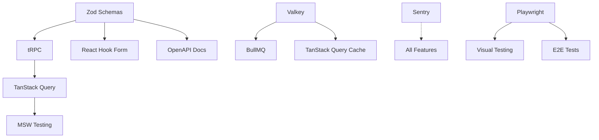

# Technology Stack Recommendations for Pressograph 2.0

**Document Version:** 1.0
**Date:** November 3, 2025
**Status:** Draft for Review

---

## Executive Summary

This document analyzes the current Pressograph 2.0 technology stack and proposes strategic additions to enhance development experience, monitoring, testing, security, and production readiness.

**Current Foundation:**
- **Frontend:** Next.js 16.0 + React 19.2 + TypeScript 5.9
- **Styling:** TailwindCSS 4.1.16 + shadcn/ui v3.5
- **Database:** PostgreSQL 18 + Drizzle ORM 0.44.7
- **Cache:** Valkey 9 (Redis-compatible)
- **Authentication:** NextAuth 4.24.13
- **State Management:** Zustand 5.0.8
- **i18n:** next-intl 4.4.0

---

## Recommended Technologies

### 1. API Layer: tRPC

**Status:** ✅ RECOMMENDED (High Priority)

#### Details
- **Version:** `@trpc/server` v11.x, `@trpc/client` v11.x, `@trpc/next` v11.x
- **Official Docs:** https://trpc.io/docs

#### Purpose
Replace traditional REST API routes with end-to-end type-safe RPC calls. Perfect for Next.js + TypeScript projects where frontend and backend share the same codebase.

#### Benefits for Pressograph
1. **End-to-End Type Safety:** TypeScript types flow automatically from server to client
2. **No Code Generation:** Unlike GraphQL, no build step required
3. **Autocomplete Everywhere:** VSCode autocompletes API calls, params, and responses
4. **Reduced Boilerplate:** No need to write API routes + fetch wrappers separately
5. **Built-in Validation:** Integrates seamlessly with Zod (already in stack)
6. **Server-Side Rendering:** First-class support for Next.js App Router

#### Integration Complexity
**2/5** - Moderate

- Create `src/server/trpc/` directory structure
- Define routers and procedures
- Wrap app with tRPC provider
- Migrate existing API routes gradually

#### Implementation Effort
**12-16 hours**

- Initial setup: 2 hours
- Create base routers: 4 hours
- Migrate 5-10 routes: 6-10 hours
- Documentation: 2 hours

#### Dependencies
- Zod (already installed ✓)
- React Query/TanStack Query (see recommendation #4)

#### Alternatives Considered
- **GraphQL with Pothos:** More powerful but steeper learning curve, overkill for Pressograph
- **REST with OpenAPI:** Traditional approach, lacks type safety without code generation

#### Example Usage
```typescript
// Server: src/server/trpc/routers/graph.ts
export const graphRouter = router({
  getById: publicProcedure
    .input(z.object({ id: z.string().uuid() }))
    .query(async ({ input, ctx }) => {
      return await ctx.db.query.pressureTests.findFirst({
        where: eq(pressureTests.id, input.id),
      });
    }),

  create: protectedProcedure
    .input(createPressureTestSchema)
    .mutation(async ({ input, ctx }) => {
      return await ctx.db.insert(pressureTests).values(input);
    }),
});

// Client: src/app/graphs/[id]/page.tsx
const graph = api.graph.getById.useQuery({ id: params.id });
```

---

### 2. Testing: Playwright + Vitest + MSW

**Status:** ✅ RECOMMENDED (High Priority)

#### Details
- **Playwright:** v1.50+ (E2E testing)
- **Vitest:** Already installed (v3.2.4 ✓) - for unit/integration tests
- **MSW (Mock Service Worker):** v2.x - for API mocking
- **Official Docs:**
  - https://playwright.dev/
  - https://vitest.dev/
  - https://mswjs.io/

#### Purpose
Comprehensive testing strategy covering unit, integration, and end-to-end tests.

#### Benefits for Pressograph
1. **E2E Testing:** Playwright tests real user flows (login, create graph, export)
2. **Component Testing:** Vitest + React Testing Library for isolated component tests
3. **API Mocking:** MSW intercepts network requests for predictable testing
4. **Fast Feedback:** Vitest runs in milliseconds (Vite-powered)
5. **CI/CD Ready:** Both tools integrate easily with GitHub Actions
6. **Visual Regression:** Playwright can capture screenshots for UI changes

#### Integration Complexity
**3/5** - Moderate to High

- Install and configure Playwright
- Install MSW and setup handlers
- Write test utilities and fixtures
- Create CI/CD pipeline

#### Implementation Effort
**24-32 hours**

- Playwright setup: 4 hours
- MSW setup: 3 hours
- Write first 10 E2E tests: 12 hours
- Write first 20 unit tests: 8 hours
- CI/CD integration: 4 hours
- Documentation: 3 hours

#### Dependencies
- None (Vitest already installed ✓)

#### Alternatives Considered
- **Cypress:** Popular but slower than Playwright, less TypeScript support
- **Jest:** Legacy, Vitest is faster and better for Vite projects

#### Recommended Test Coverage Targets
- **Critical Paths:** 100% (auth, graph generation, export)
- **Core Features:** 80%+
- **UI Components:** 60%+

---

### 3. Monitoring & Observability: Sentry + Vercel Analytics

**Status:** ✅ RECOMMENDED (High Priority)

#### Details
- **Sentry:** Error tracking, performance monitoring, session replay
- **Vercel Analytics:** Web vitals, user analytics (if deploying to Vercel)
- **Official Docs:**
  - https://docs.sentry.io/platforms/javascript/guides/nextjs/
  - https://vercel.com/docs/analytics

#### Purpose
Production monitoring, error tracking, and performance insights.

#### Benefits for Pressograph
1. **Real-Time Error Tracking:** Get notified when users hit errors
2. **Source Maps:** See exact line of code causing errors
3. **Session Replay:** Watch user sessions leading to errors (Sentry Replay)
4. **Performance Monitoring:** Track API response times, page load times
5. **User Context:** See which users are affected, browser, device info
6. **Release Tracking:** Correlate errors with specific deployments

#### Integration Complexity
**1/5** - Very Easy

- Install Sentry SDK
- Add init code to Next.js config
- Configure error boundaries
- Set up release tracking

#### Implementation Effort
**4-6 hours**

- Sentry setup: 2 hours
- Error boundaries: 1 hour
- Vercel Analytics: 30 minutes
- Testing and verification: 1.5 hours
- Documentation: 1 hour

#### Dependencies
- None

#### Alternatives Considered
- **LogRocket:** Similar to Sentry but more expensive, less community support
- **OpenTelemetry:** Open-source but requires more infrastructure (Grafana, Prometheus)
- **Self-hosted:** More work to maintain, Sentry free tier is generous

#### Cost Considerations
- **Sentry Free Tier:** 5,000 errors/month, 10,000 transactions/month
- **Vercel Analytics:** Free on Pro plan
- **Upgrade:** ~$26/month for Sentry Team plan (higher limits)

---

### 4. Server State Management: TanStack Query (React Query)

**Status:** ✅ RECOMMENDED (Medium Priority)

#### Details
- **Version:** `@tanstack/react-query` v6.x
- **Official Docs:** https://tanstack.com/query/latest

#### Purpose
Manage server state (API data) separately from client state (UI state). Handles caching, refetching, optimistic updates, and more.

#### Benefits for Pressograph
1. **Automatic Caching:** Reduce API calls, cache in Valkey for persistence
2. **Background Refetching:** Keep data fresh without user action
3. **Optimistic Updates:** Update UI immediately, rollback on error
4. **Devtools:** Inspect queries, mutations, cache state
5. **Works with tRPC:** Seamless integration (tRPC uses React Query internally)
6. **Pagination & Infinite Scroll:** Built-in support

#### Integration Complexity
**2/5** - Moderate

- Wrap app with QueryClientProvider
- Convert fetch calls to useQuery/useMutation
- Configure cache strategies
- Integrate with Valkey for SSR hydration

#### Implementation Effort
**8-12 hours**

- Setup: 2 hours
- Migrate 10-15 data fetching hooks: 6-8 hours
- Configure devtools: 1 hour
- Documentation: 1 hour

#### Dependencies
- None (works standalone, enhanced with tRPC)

#### Alternatives Considered
- **SWR:** Lighter alternative, less features, created by Vercel
- **Apollo Client:** For GraphQL only, overkill for Pressograph

#### Example Usage
```typescript
// Fetch graph data with automatic caching
const { data, isLoading, error } = useQuery({
  queryKey: ['graph', graphId],
  queryFn: () => fetchGraph(graphId),
  staleTime: 5 * 60 * 1000, // 5 minutes
  cacheTime: 10 * 60 * 1000, // 10 minutes
});

// Optimistic mutation
const mutation = useMutation({
  mutationFn: updateGraph,
  onMutate: async (newGraph) => {
    // Optimistically update UI
    await queryClient.cancelQueries(['graph', graphId]);
    const previous = queryClient.getQueryData(['graph', graphId]);
    queryClient.setQueryData(['graph', graphId], newGraph);
    return { previous };
  },
  onError: (err, newGraph, context) => {
    // Rollback on error
    queryClient.setQueryData(['graph', graphId], context.previous);
  },
});
```

---

### 5. Component Development: Storybook

**Status:** 🟡 OPTIONAL (Medium Priority)

#### Details
- **Version:** Storybook v8.x for Next.js
- **Official Docs:** https://storybook.js.org/docs/get-started/nextjs

#### Purpose
Develop, test, and document UI components in isolation.

#### Benefits for Pressograph
1. **Isolated Development:** Build components without running full app
2. **Visual Testing:** See all component states (loading, error, success)
3. **Documentation:** Auto-generate component docs from prop types
4. **Design System:** Maintain consistency across shadcn/ui components
5. **Accessibility Testing:** Built-in a11y addon
6. **Interaction Testing:** Test user interactions in isolation

#### Integration Complexity
**3/5** - Moderate to High

- Install Storybook for Next.js
- Create stories for existing components
- Configure addons (a11y, interactions)
- Set up deployment (Chromatic or static build)

#### Implementation Effort
**16-24 hours**

- Initial setup: 4 hours
- Create 20-30 stories: 12-16 hours
- Configure addons: 2 hours
- Deploy to hosting: 2 hours
- Documentation: 2 hours

#### Dependencies
- None

#### Alternatives Considered
- **Histoire:** Vite-native alternative, less mature
- **Ladle:** Lightweight, fewer features

#### When to Implement
- After 15-20 UI components are built
- When design system stabilizes
- Before onboarding new frontend developers

---

### 6. Background Jobs: BullMQ

**Status:** 🟡 OPTIONAL (Low Priority)

#### Details
- **Version:** `bullmq` v6.x
- **Official Docs:** https://docs.bullmq.io/

#### Purpose
Process async tasks in background (email sending, graph generation, PDF exports).

#### Benefits for Pressograph
1. **Async Processing:** Don't block user while generating complex graphs
2. **Retry Logic:** Automatic retries for failed jobs
3. **Scheduling:** Schedule periodic tasks (cleanup, reports)
4. **Priority Queues:** Prioritize important exports
5. **Valkey Backend:** Uses existing Valkey infrastructure
6. **Monitoring:** Built-in UI for job status

#### Integration Complexity
**3/5** - Moderate

- Install BullMQ
- Create queue definitions
- Set up workers
- Add job scheduling to API routes

#### Implementation Effort
**12-16 hours**

- Setup: 3 hours
- Create 3-5 job types: 6-8 hours
- Worker configuration: 2 hours
- Monitoring UI: 2 hours
- Documentation: 2 hours

#### Dependencies
- Valkey (already installed ✓)

#### Alternatives Considered
- **pg-boss:** PostgreSQL-based, no need for Redis, but less features
- **Quirrel:** Serverless job scheduling, requires external service

#### Use Cases for Pressograph
- **PDF Generation:** Render graphs to PDF in background
- **Batch Export:** Export multiple graphs at once
- **Email Notifications:** Send test completion emails
- **Data Cleanup:** Archive old graphs periodically

---

### 7. Email: React Email + Resend

**Status:** 🟡 OPTIONAL (Medium Priority)

#### Details
- **React Email:** v3.x - Email templates with React components
- **Resend:** Email delivery API (Vercel-backed)
- **Official Docs:**
  - https://react.email/
  - https://resend.com/docs

#### Purpose
Send transactional emails (verification, password reset, export ready notifications).

#### Benefits for Pressograph
1. **React Components:** Write emails like React components
2. **Type-Safe:** Full TypeScript support
3. **Preview:** See emails in browser before sending
4. **Modern Design:** Responsive, mobile-friendly by default
5. **Delivery:** Resend has 98%+ deliverability, free tier available
6. **Testing:** Preview emails in development

#### Integration Complexity
**2/5** - Moderate

- Install React Email and Resend
- Create email templates
- Configure SMTP/Resend API
- Add email utilities

#### Implementation Effort
**8-12 hours**

- Setup: 2 hours
- Create 3-5 email templates: 4-6 hours
- Integration with auth flow: 2 hours
- Testing: 2 hours
- Documentation: 2 hours

#### Dependencies
- None

#### Alternatives Considered
- **Nodemailer + Handlebars:** Traditional approach, less modern
- **SendGrid:** More expensive, less developer-friendly
- **Postmark:** Similar to Resend, smaller free tier

#### Cost Considerations
- **Resend Free Tier:** 3,000 emails/month, 100 emails/day
- **Paid Plan:** $20/month for 50,000 emails

---

### 8. Form Validation: React Hook Form + Zod

**Status:** ✅ ALREADY IMPLEMENTED

**Current Status:** Both packages already installed ✓
- `react-hook-form` v7.54.2
- `zod` v3.24.1
- `@hookform/resolvers` v3.9.1

#### Recommended Enhancement
Create shared Zod schemas library:
```
src/lib/validation/
  ├── schemas/
  │   ├── auth.ts        # Login, register, password reset
  │   ├── graph.ts       # Pressure test settings
  │   ├── user.ts        # User profile, settings
  │   └── index.ts
  └── index.ts
```

#### Implementation Effort
**4-6 hours** to create comprehensive schema library

---

### 9. API Documentation: OpenAPI with zod-openapi

**Status:** 🟡 OPTIONAL (Low Priority)

#### Details
- **Version:** `zod-openapi` v2.x
- **Official Docs:** https://github.com/samchungy/zod-openapi

#### Purpose
Generate OpenAPI (Swagger) documentation from Zod schemas automatically.

#### Benefits for Pressograph
1. **Auto-Generated Docs:** API docs stay in sync with code
2. **Interactive UI:** Swagger UI for testing APIs
3. **Type-Safe:** Leverages existing Zod schemas
4. **External Integrations:** Third-party tools can consume OpenAPI spec
5. **Validation:** Ensures API responses match documented schemas

#### Integration Complexity
**2/5** - Moderate

- Install zod-openapi
- Annotate existing Zod schemas
- Generate OpenAPI spec
- Serve Swagger UI

#### Implementation Effort
**6-8 hours**

- Setup: 2 hours
- Annotate 10-15 schemas: 3-4 hours
- Configure Swagger UI: 1 hour
- Documentation: 1 hour

#### Dependencies
- Zod (already installed ✓)
- Swagger UI (optional)

#### When to Implement
- If building public API
- If working with external contractors
- If documentation is a requirement

---

### 10. Linting & Formatting: Biome (Alternative to ESLint + Prettier)

**Status:** 🔴 NOT RECOMMENDED (Consider for v2.1)

#### Details
- **Version:** Biome v1.x
- **Official Docs:** https://biomejs.dev/

#### Why NOT Recommended Now
1. **ESLint + Prettier Already Configured:** No immediate benefit
2. **Ecosystem Maturity:** ESLint has more plugins and community support
3. **Migration Effort:** Would require rewriting all config files
4. **Team Familiarity:** ESLint/Prettier more widely known

#### When to Reconsider
- v2.1 or later when considering tooling refresh
- If build times become an issue (Biome is 25x faster)
- If Biome plugin ecosystem catches up

---

## Implementation Roadmap

### Phase 1: Foundation (Sprint 1-2) - IMMEDIATE
**Priority:** High
**Effort:** 20-24 hours

1. **Sentry Error Tracking** (4-6 hours) - CRITICAL for production
2. **tRPC Setup** (12-16 hours) - Sets foundation for type-safe APIs
3. **Comprehensive Zod Schemas** (4-6 hours) - Required for validation

**Why These First:**
- Sentry catches production issues immediately
- tRPC provides type safety for all future API development
- Zod schemas enable both tRPC and form validation

---

### Phase 2: Testing & Quality (Sprint 3-4)
**Priority:** High
**Effort:** 28-36 hours

1. **Playwright E2E Tests** (16-20 hours) - Critical user flows
2. **MSW API Mocking** (3 hours) - Predictable tests
3. **Vitest Unit Tests** (12-16 hours) - Component and utility tests

**Why Second:**
- Tests ensure refactoring doesn't break features
- Catches bugs before production
- Required for confident deployments

---

### Phase 3: Developer Experience (Sprint 5-6)
**Priority:** Medium
**Effort:** 24-32 hours

1. **TanStack Query** (8-12 hours) - Better server state management
2. **React Email + Resend** (8-12 hours) - Transactional emails
3. **Vercel Analytics** (2 hours) - User behavior insights
4. **Storybook** (16-24 hours) - Component development

**Why Third:**
- Improves developer productivity
- Nice-to-have features for users
- Can be implemented in parallel

---

### Phase 4: Advanced Features (Sprint 7-8)
**Priority:** Low
**Effort:** 18-24 hours

1. **BullMQ** (12-16 hours) - Background job processing
2. **OpenAPI Docs** (6-8 hours) - API documentation

**Why Last:**
- Not critical for MVP
- Can be added as features grow
- Requires mature API surface to document

---

## Dependency Matrix



**Legend:**
- Solid Arrow: Hard dependency
- Dotted Arrow: Soft dependency/enhancement

---

## Cost Analysis

### Free Tier (Sustainable for Early Stage)

| Service | Free Tier | Cost at Scale |
|---------|-----------|---------------|
| Sentry | 5K errors/month | $26/month (Team plan) |
| Resend | 3K emails/month | $20/month (50K emails) |
| Vercel Analytics | Included on Hobby | Included on Pro ($20/month) |
| All Dev Tools | Free (open source) | Free |

**Total Monthly Cost (Free Tier):** $0
**Total Monthly Cost (Small Business):** ~$50-70/month

---

## Metrics for Success

### Code Quality Metrics
- **Test Coverage:** 80%+ for critical paths
- **Type Safety:** 100% (no `any` types)
- **Error Rate:** <0.1% of requests (tracked by Sentry)
- **Build Time:** <60 seconds (Next.js build)

### Developer Experience Metrics
- **PR Cycle Time:** <24 hours from open to merge
- **CI/CD Time:** <10 minutes for full pipeline
- **New Developer Onboarding:** <4 hours to first PR

### User Experience Metrics
- **Core Web Vitals:** All metrics in "Good" range
- **API Response Time:** <200ms p95
- **Error-Free Sessions:** >99%

---

## Decision Framework

For each technology, ask:

1. **Does it solve a current pain point?** (Not future-proofing)
2. **Does it integrate with our existing stack?** (Avoid silos)
3. **Can it be adopted incrementally?** (No big bang rewrites)
4. **Is the team ready to learn it?** (Skill level check)
5. **What's the maintenance burden?** (Long-term cost)

**Score each 1-5, average ≥3.5 = Proceed**

---

## Conclusion

**Must Implement (Sprint 1-4):**
1. ✅ Sentry (Error tracking)
2. ✅ tRPC (Type-safe APIs)
3. ✅ Playwright + MSW (Testing)
4. ✅ TanStack Query (Server state)

**Should Implement (Sprint 5-8):**
5. 🟡 React Email + Resend (Emails)
6. 🟡 Storybook (Component development)
7. 🟡 Vercel Analytics (User insights)

**Nice to Have (Post-MVP):**
8. 🟡 BullMQ (Background jobs)
9. 🟡 OpenAPI Docs (API documentation)

**Not Recommended:**
10. 🔴 Biome (Wait for ecosystem maturity)

---

## Next Steps

1. **Team Review:** Discuss this document in next planning meeting
2. **Prioritize:** Finalize sprint assignments
3. **Create Issues:** One GitHub issue per technology
4. **Assign Story Points:** Use complexity ratings as baseline
5. **Start with Sentry:** Critical for production monitoring

---

## References

- [Next.js 16 Documentation](https://nextjs.org/docs)
- [React 19 Documentation](https://react.dev/)
- [TailwindCSS 4 Documentation](https://tailwindcss.com/docs)
- [Drizzle ORM Documentation](https://orm.drizzle.team/docs/overview)
- [tRPC Documentation](https://trpc.io/docs)
- [TanStack Query Documentation](https://tanstack.com/query/latest)
- [Playwright Documentation](https://playwright.dev/docs/intro)
- [Sentry Next.js Guide](https://docs.sentry.io/platforms/javascript/guides/nextjs/)

---

**Document Maintainer:** Development Team
**Last Updated:** November 3, 2025
**Next Review:** After Sprint 2 completion
