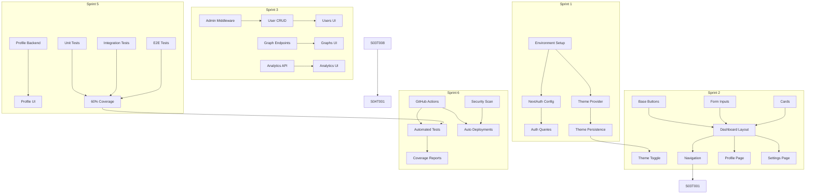
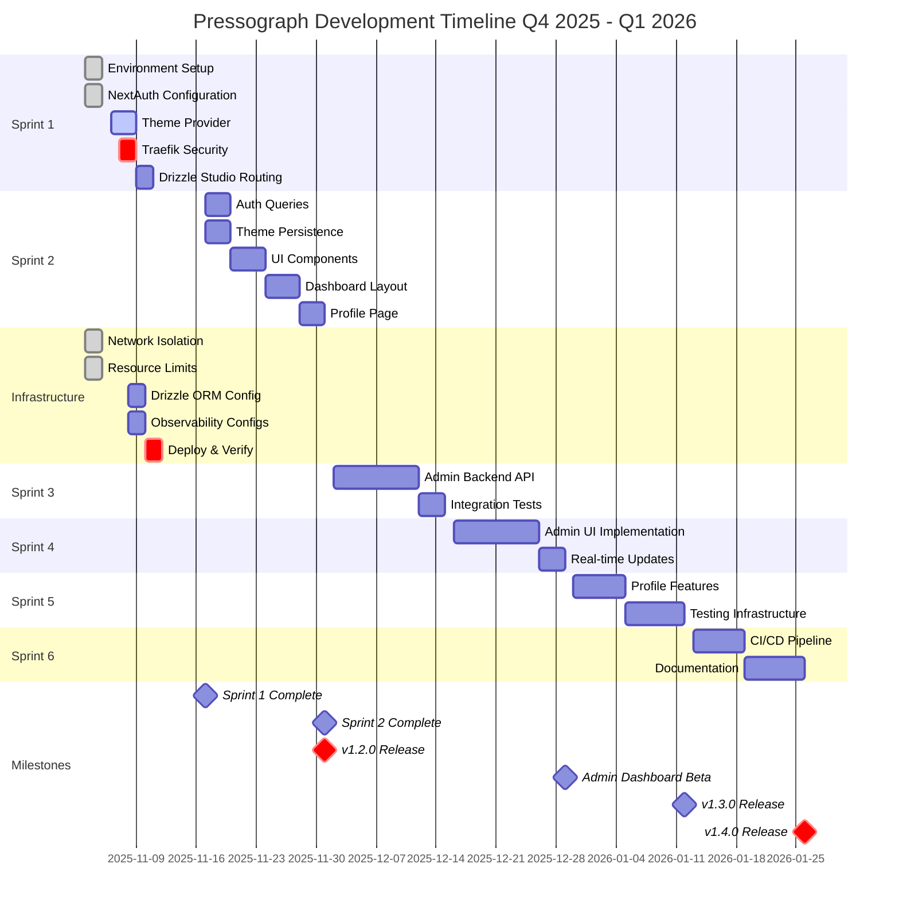

# Pressograph Development Roadmap

**Version:** 2.0.0
**Last Updated:** 2025-11-06
**Project Status:** Active Development - Sprint 1 In Progress
**Planning Horizon:** Q4 2025 - Q1 2026 (6 months)

## 📋 Table of Contents

- [Executive Summary](#executive-summary)
- [Current State](#current-state)
- [Strategic Goals](#strategic-goals)
- [Sprint Overview](#sprint-overview)
- [Detailed Sprint Plans](#detailed-sprint-plans)
- [Task Dependencies](#task-dependencies)
- [Timeline Visualization](#timeline-visualization)
- [Risk Management](#risk-management)
- [Resource Planning](#resource-planning)
- [Milestone Synchronization](#milestone-synchronization)
- [Critical Path Analysis](#critical-path-analysis)
- [Recommendations](#recommendations)

---

## Executive Summary

Pressograph is undergoing a major architectural transformation from a Vite-based React application to a modern Next.js 15 + React 19 platform. This roadmap provides a comprehensive 6-month development plan synchronized with GitHub issues, milestones, and the existing sprint structure.

### Key Highlights

- **Current Release:** v2.0.0-alpha (major refactor complete)
- **Architecture Migration:** Vite → Next.js 15.5.6 completed
- **Active Sprint:** Sprint 1 - Foundation Setup (2025-11-03 to 2025-11-17)
- **Planned Sprints:** 6 sprints over 12 weeks
- **Total Story Points:** ~240 points planned
- **Team Velocity:** 15-21 SP/week (baseline established from infrastructure hardening sprint)

### Critical Success Factors

1. Complete authentication system with NextAuth + Drizzle adapter
2. Establish production-ready observability stack (VictoriaMetrics, Uptrace)
3. Implement comprehensive theme management system
4. Build reusable UI component library
5. Achieve >60% test coverage
6. Deploy CI/CD pipeline

---

## Current State

### Project Status (as of 2025-11-06)

**Latest Version:** v2.0.0-alpha (released 2025-11-05)

**Major Accomplishments:**
- ✅ Complete migration to Next.js 15.5.6 + React 19.2.0
- ✅ Drizzle ORM 0.44.7 integration with comprehensive schema (13 tables)
- ✅ PostgreSQL 18 + Valkey 9 infrastructure
- ✅ OpenTelemetry + VictoriaMetrics observability stack
- ✅ Network isolation with IPAM (3 dedicated networks)
- ✅ Resource limits on all containerized services
- ✅ PM2 auto-start for Next.js dev server
- ✅ Traefik HTTPS routing configured

**Technical Stack:**
- **Frontend:** Next.js 15.5.6, React 19.2.0, TypeScript 5.9.3, TailwindCSS 4.1.16
- **Backend:** Node.js 24 LTS, Drizzle ORM 0.44.7, NextAuth 4.24.13
- **Database:** PostgreSQL 18.0
- **Cache:** Valkey 9 (Redis-compatible)
- **State Management:** Zustand 5.0.8 + Immer
- **Data Fetching:** TanStack Query 5.90.6
- **UI Components:** Radix UI primitives
- **Observability:** VictoriaMetrics, VictoriaLogs, OpenTelemetry
- **Monitoring:** Grafana 11.x
- **Reverse Proxy:** Traefik 3.x
- **Container Runtime:** Podman/Docker compatible

### GitHub Statistics

**Total Issues:** 58 created
- **Open:** 22 issues
- **Closed:** 36 issues
- **Completion Rate:** 62%

**Active Milestones:** 3
1. Sprint 1: Foundation Setup (due 2025-11-17) - 10 issues
2. Sprint 2: Infrastructure Hardening (due 2025-11-09) - 3 issues
3. Product Backlog - Long-term planning

**Closed Milestones:** Multiple legacy milestones from Vite-based version

### Current Sprint Status

**Sprint 1: Foundation Setup**
- **Duration:** 2025-11-03 to 2025-11-17 (2 weeks)
- **Planned SP:** 22 (reduced from 27 - removed Traefik BasicAuth)
- **Completed SP:** 9
- **Remaining SP:** 13
- **Progress:** 41% complete

**Completed Tasks:**
- Environment setup with Podman (2 SP)
- Valkey cache integration (2 SP)
- Package version updates (1 SP)
- PM2 auto-start configuration (1 SP)
- Traefik HTTPS routing (1 SP)
- Next.js downgrade from 16.0.1 to stable 15.5.6 (2 SP)

**In Progress:**
- NextAuth configuration (#37) - COMPLETED 2025-11-05
- Theme provider implementation (#38)
- Valkey cache integration (#36)
- Technology stack analysis (#39)

**Notes:**
- ✅ Issue #45: Traefik BasicAuth closed - authentication handled by NextAuth at application level
- 🔄 Issue #46: Drizzle Studio routing - under review, may not need external access

### Recent Infrastructure Hardening Sprint

**Emergency Sprint:** 2025-11-03 to 2025-11-10
- **Completed:** 15 SP / 21 SP planned (71% velocity)
- **Focus:** Security remediation, network isolation, resource limits
- **Status:** Partially complete, remaining work moved to issues #56, #57, #58

---

## Strategic Goals

### Q4 2025 Goals (Nov - Dec 2025)

#### 1. Foundation & Security (Priority: CRITICAL)
- Complete authentication system with NextAuth + Drizzle
- Implement secure theme management (cookie → DB → Valkey)
- Establish comprehensive RBAC system
- Deploy production-ready observability stack
- Achieve WCAG 2.1 AA accessibility compliance

#### 2. Core Features (Priority: HIGH)
- Build reusable UI component library (Radix UI + CVA)
- Implement 4-step guided workflow for pressure test creation
- Create responsive dashboard with sidebar navigation
- Develop user profile and settings management
- Public share links with analytics

#### 3. Quality & Performance (Priority: HIGH)
- Establish testing infrastructure (Vitest + Playwright)
- Achieve 60%+ test coverage
- Optimize theme switching performance (<50ms)
- Implement React component memoization patterns
- Bundle size optimization (<250KB initial)

### Q1 2026 Goals (Jan - Mar 2026)

#### 4. Advanced Features (Priority: MEDIUM)
- Admin dashboard with user management
- API key management system
- Batch operations for exports
- Real-time collaboration features
- Advanced analytics and reporting

#### 5. DevOps & Automation (Priority: HIGH)
- CI/CD pipeline with GitHub Actions
- Automated testing on PRs
- Automated deployments (dev/staging/prod)
- Security scanning (Snyk, CodeQL)
- Performance monitoring and alerting

#### 6. Documentation & Community (Priority: MEDIUM)
- Comprehensive user guide
- API documentation with OpenAPI 3.1
- Video tutorials (Russian/English)
- Architecture diagrams (Mermaid/Kroki)
- Contribution guidelines

### Long-Term Vision (2026+)

- GraphQL API layer
- Mobile applications (React Native)
- Multi-tenancy support
- LDAP/SSO integration
- Advanced data visualization
- Machine learning for anomaly detection

---

## Sprint Overview

| Sprint | Dates | Goal | Milestone | Status | Issues | Story Points |
|--------|-------|------|-----------|--------|--------|--------------|
| **Sprint 01** | 2025-11-03 to 2025-11-17 | Foundation Setup | [Milestone #9](https://github.com/dantte-lp/pressograph/milestone/9) | 🚧 In Progress | #35, #36, #37, #38, #39, #40-#48 | 22 SP |
| **Sprint 02** | 2025-11-17 to 2025-12-01 | Authentication & Core UI | [Milestone #10](https://github.com/dantte-lp/pressograph/milestone/10) | ⏸️ Planned | TBD | 40 SP |
| **Infrastructure** | 2025-11-03 to 2025-11-10 | Security Hardening | [Milestone #17](https://github.com/dantte-lp/pressograph/milestone/17) | ⏸️ Partial | #51-#58 | 21 SP (15 complete) |
| **Sprint 03** | 2025-12-02 to 2025-12-15 | Admin Dashboard Backend | Planned | ⏸️ Not Started | TBD | 40 SP |
| **Sprint 04** | 2025-12-16 to 2025-12-29 | Admin Dashboard Frontend | Planned | ⏸️ Not Started | TBD | 42 SP |
| **Sprint 05** | 2025-12-30 to 2026-01-12 | Profile & Testing | Planned | ⏸️ Not Started | TBD | 40 SP |
| **Sprint 06** | 2026-01-13 to 2026-01-26 | CI/CD & Documentation | Planned | ⏸️ Not Started | TBD | 40 SP |

**Total Planned Work:** 245 story points across 6 sprints + infrastructure
**Average Sprint Velocity:** 40 SP (adjusted based on initial sprints)
**Timeline:** 14 weeks (including infrastructure sprint)

---

## Detailed Sprint Plans

### Sprint 01: Foundation Setup
**Duration:** 2025-11-03 to 2025-11-17 (2 weeks)
**Milestone:** [Sprint 1: Foundation Setup](https://github.com/dantte-lp/pressograph/milestone/9)
**Sprint Goal:** Complete core infrastructure and establish development baseline
**Status:** 🚧 In Progress (41% complete)

#### Sprint Objectives
1. ✅ Establish stable Next.js 15 environment
2. ✅ Configure Valkey cache integration
3. Configure NextAuth with Drizzle adapter
4. Implement theme provider with dark mode
5. Create base UI component structure
6. Set up development workflows

#### Tasks Breakdown

| ID | Task | Issue | Priority | Estimate | Status | Blockers |
|----|------|-------|----------|----------|--------|----------|
| S01-T001 | Environment Setup | #35 | P0 | 2 SP | ✅ Complete | None |
| S01-T002 | Valkey Cache Integration | #36 | P0 | 2 SP | 🚧 In Progress | None |
| S01-T003 | NextAuth Configuration | #37 | P0 | 8 SP | ✅ Complete | None |
| S01-T004 | Theme Provider Implementation | #38 | P1 | 3 SP | 🚧 In Progress | None |
| S01-T005 | Technology Stack Analysis | #39 | P2 | 2 SP | 🚧 In Progress | None |
| S01-T006 | PM2 Auto-start Configuration | #43, #44 | P1 | 1 SP | ✅ Complete | None |
| S01-T007 | Traefik HTTPS Routing | #41, #48 | P1 | 1 SP | ✅ Complete | None |
| S01-T008 | PostCSS Configuration | #42 | P1 | 1 SP | ✅ Complete | None |
| S01-T009 | Node.js 24 LTS Verification | #40, #47 | P1 | 1 SP | ✅ Complete | None |
| S01-T011 | Drizzle Studio Routing | #46 | P2 | 3 SP | 🔄 Under Review | May not be needed |
| S01-T012 | Package Version Updates | - | P2 | 1 SP | ✅ Complete | None |
| S01-T013 | Next.js Downgrade (16→15.5.6) | - | P0 | 2 SP | ✅ Complete | None |

**Total:** 22 SP planned, 9 SP completed, 13 SP remaining

#### Detailed Task Specifications

##### S01-T003: NextAuth Configuration
- **GitHub Issue:** [#37](https://github.com/dantte-lp/pressograph/issues/37)
- **Priority:** P0 (Critical)
- **Estimate:** 8 SP
- **Status:** ✅ COMPLETED (2025-11-05)
- **Assignee:** dantte-lp
- **Dependencies:** S01-T001 (Environment Setup)

**Description:**
Configure NextAuth 4.24 with Drizzle adapter for PostgreSQL-backed authentication.

**Acceptance Criteria:**
- [x] NextAuth configured with Drizzle adapter
- [x] Database schema includes auth tables (accounts, sessions, verification_tokens)
- [x] OAuth providers configured (GitHub, Google)
- [x] Session management working
- [x] Protected routes redirect to login
- [x] Logout functionality clears session

**Subtasks:**
- [x] Install @auth/drizzle-adapter (1h)
- [x] Create auth schema in Drizzle (2h)
- [x] Configure NextAuth API route (2h)
- [x] Set up OAuth providers (2h)
- [x] Implement session hooks (1h)
- [x] Test authentication flow (2h)

**Blockers:** None

---

##### S01-T004: Theme Provider Implementation
- **GitHub Issue:** [#38](https://github.com/dantte-lp/pressograph/issues/38)
- **Priority:** P1 (High)
- **Estimate:** 3 SP
- **Status:** 🚧 In Progress
- **Assignee:** TBD
- **Dependencies:** S01-T001 (Environment Setup)

**Description:**
Implement three-tier theme management system (Cookie → Database → Valkey) with server-side rendering support.

**Acceptance Criteria:**
- [ ] Theme cookie set on first visit
- [ ] Theme stored in user_preferences table
- [ ] Theme cached in Valkey (1h TTL)
- [ ] No FOUC (Flash of Unstyled Content)
- [ ] Dark/Light mode toggle component
- [ ] Theme syncs across devices for logged-in users
- [ ] System theme detection (prefers-color-scheme)

**Subtasks:**
- [ ] Create theme cookie middleware (1h)
- [ ] Implement theme server actions (2h)
- [ ] Create ThemeProvider component (2h)
- [ ] Build theme toggle UI (1h)
- [ ] Integrate with Valkey cache (1h)
- [ ] Test SSR theme injection (1h)

**Blockers:**
- **Technical:** Need to finalize user_preferences schema
- **Process:** Waiting for design tokens decision

---


##### S01-T011: Drizzle Studio Routing (Under Review)
- **GitHub Issue:** [#46](https://github.com/dantte-lp/pressograph/issues/46)
- **Priority:** P2 (Reduced from P1)
- **Estimate:** 3 SP
- **Status:** 🔄 Under Review
- **Assignee:** TBD
- **Dependencies:** None (previously depended on #45)

**Description:**
Configure Traefik routing for Drizzle Studio with secure HTTPS access at dbdev-pressograph.infra4.dev.

**Note:** This task is under review as BasicAuth has been removed from the project scope. Options being considered:
1. Close this issue if external access is not needed
2. Use SSH port-forwarding for development access
3. Implement application-level authentication if external access is required

**Original Acceptance Criteria (Under Review):**
- [ ] DNS record created for dbdev-pressograph.infra4.dev
- [ ] HTTP redirects to HTTPS
- [ ] Valid Let's Encrypt certificate issued
- [ ] ~~BasicAuth authentication required~~ (removed from scope)
- [ ] Accessible from remote locations
- [ ] Traefik dashboard shows router: drizzle-studio@docker

**Subtasks:**
- [ ] Create DNS A record (15m)
- [ ] Configure Traefik labels in compose.dev.yaml (1h)
- [ ] Set up HTTP→HTTPS redirect (30m)
- [ ] Configure TLS certificate resolver (30m)
- [ ] Apply BasicAuth middleware (30m)
- [ ] Test remote access (1h)

**Blockers:**
- **Dependency:** Requires S01-T010 (BasicAuth) to be completed first
- **External:** DNS propagation may take up to 24 hours

---

#### Sprint 01 Risks

| Risk | Probability | Impact | Mitigation |
|------|------------|--------|------------|
| ~~BasicAuth not deployed in time~~ | ~~Medium~~ | ~~High~~ | Removed from scope - using NextAuth instead |
| Theme system complexity | Medium | Medium | Use proven patterns, defer advanced features |
| NextAuth + Drizzle adapter issues | Low | High | Reference official examples, extensive testing |
| DNS propagation delays | Low | Low | Plan work around DNS changes |

#### Sprint 01 Velocity

- **Planned:** 22 SP (reduced from 27 SP)
- **Completed (so far):** 9 SP
- **Remaining:** 13 SP
- **Days Left:** 11 days (as of 2025-11-06)
- **Required Velocity:** 1.2 SP/day
- **Historical Velocity:** 2.1 SP/day (from infrastructure sprint)

**Assessment:** Sprint on track. With reduced scope, completion is highly likely.

---

### Sprint 02: Authentication & Core UI
**Duration:** 2025-11-17 to 2025-12-01 (2 weeks)
**Milestone:** [Sprint 2 - Authentication & Core UI](https://github.com/dantte-lp/pressograph/milestone/10)
**Sprint Goal:** Complete authentication system and establish core UI framework
**Status:** ⏸️ Planned

#### Sprint Objectives
1. Fix remaining Next.js 15 build issues
2. Complete NextAuth integration
3. Implement comprehensive theme system
4. Build core UI component library
5. Create dashboard layout and navigation
6. Implement user profile and settings pages

#### Prerequisites from Sprint 1
- [x] Next.js 15.5.6 build fully working
- [ ] Database schema finalized
- [ ] Development environment stable
- [ ] GitHub issues organized

#### High Priority Tasks (Must Have)

| ID | Task | Issue | Priority | Estimate | Dependencies | Status |
|----|------|-------|----------|----------|--------------|--------|
| S02-T001 | Fix Html import build error | TBD | P0 | 1 SP | None | 📝 Need to create |
| S02-T002 | Drizzle-compatible auth queries | TBD | P0 | 3 SP | S01-T003 | 📝 Need to create |
| S02-T003 | Theme context with persistence | TBD | P0 | 3 SP | S01-T004 | 📝 Need to create |
| S02-T004 | Dark/Light mode toggle | TBD | P1 | 2 SP | S02-T003 | 📝 Need to create |
| S02-T005 | Base button components | TBD | P1 | 2 SP | None | 📝 Need to create |
| S02-T006 | Form input components | TBD | P1 | 3 SP | None | 📝 Need to create |
| S02-T007 | Card and container components | TBD | P1 | 2 SP | None | 📝 Need to create |
| S02-T008 | Dashboard layout with sidebar | TBD | P1 | 4 SP | S02-T005 | 📝 Need to create |
| S02-T009 | Main navigation component | TBD | P1 | 3 SP | S02-T008 | 📝 Need to create |

**High Priority Total:** 23 SP

#### Medium Priority Tasks (Should Have)

| ID | Task | Issue | Priority | Estimate | Dependencies | Status |
|----|------|-------|----------|----------|--------------|--------|
| S02-T010 | User profile page with edit | TBD | P2 | 5 SP | S02-T008 | 📝 Need to create |
| S02-T011 | Settings page with preferences | TBD | P2 | 4 SP | S02-T008 | 📝 Need to create |
| S02-T012 | Toast notification system | TBD | P2 | 2 SP | None | 📝 Need to create |
| S02-T013 | Loading states and skeletons | TBD | P2 | 2 SP | None | 📝 Need to create |
| S02-T014 | Error boundary implementation | TBD | P2 | 2 SP | None | 📝 Need to create |

**Medium Priority Total:** 15 SP

#### Low Priority Tasks (Nice to Have)

| ID | Task | Issue | Priority | Estimate | Dependencies | Status |
|----|------|-------|----------|----------|--------------|--------|
| S02-T015 | Animated page transitions | TBD | P3 | 2 SP | S02-T008 | 📝 Need to create |
| S02-T016 | Breadcrumb navigation | TBD | P3 | 1 SP | S02-T008 | 📝 Need to create |
| S02-T017 | Search component | TBD | P3 | 3 SP | None | 📝 Need to create |
| S02-T018 | Keyboard shortcuts | TBD | P3 | 2 SP | None | 📝 Need to create |

**Low Priority Total:** 8 SP

**Sprint 02 Total:** 46 SP (High: 23, Medium: 15, Low: 8)

**Capacity Management:**
- Target capacity: 40 SP
- Current plan: 46 SP
- Recommendation: Defer low priority tasks (8 SP) to Sprint 03 or backlog

#### Technical Debt from Sprint 1

1. **ESLint Configuration** (2 SP)
   - Circular reference in flat config
   - Priority: P2
   - Impact: Medium

2. **Auth System** (3 SP)
   - CredentialsProvider needs implementation
   - Priority: P1
   - Impact: Medium

3. **Build Process** (1 SP)
   - Static generation Html import error
   - Priority: P0
   - Impact: High

4. **TypeScript** (2 SP)
   - Some `any` types used for quick fixes
   - Priority: P2
   - Impact: Low

**Tech Debt Total:** 8 SP (allocate 20% of sprint = 8 SP)

#### Success Criteria

- [ ] Production build completes without errors
- [ ] User can sign in via OAuth (GitHub/Google)
- [ ] Theme persists across sessions
- [ ] All core UI components have dark mode variants
- [ ] Dashboard renders with responsive layout
- [ ] User profile data displays and updates
- [ ] 90%+ TypeScript type coverage
- [ ] Zero accessibility violations (WCAG 2.1 AA)

#### Performance Targets

- Lighthouse score > 90
- First Contentful Paint < 1.5s
- Time to Interactive < 3.5s
- Bundle size < 250KB (initial)

#### Sprint 02 Risks

| Risk | Impact | Mitigation |
|------|--------|------------|
| Drizzle adapter complexity | High | Research examples, fallback to JWT sessions |
| Dark mode edge cases | Medium | Test thoroughly, use CSS variables |
| OAuth provider issues | Medium | Test in staging, have fallback auth |
| Component library scope creep | Medium | Focus on essential components only |

---

### Infrastructure Hardening Sprint
**Duration:** 2025-11-03 to 2025-11-10 (1 week)
**Milestone:** [Sprint 2: Infrastructure Hardening](https://github.com/dantte-lp/pressograph/milestone/17)
**Sprint Goal:** Security remediation and production-ready configurations
**Status:** ⏸️ Partially Complete (71% velocity)

#### Completed Work (15 SP)

| ID | Task | Issue | Priority | Estimate | Status |
|----|------|-------|----------|----------|--------|
| INF-T001 | Network isolation with IPAM | #51 | P0 | 5 SP | ✅ Complete |
| INF-T002 | Resource limits configuration | #52 | P0 | 3 SP | ✅ Complete |
| INF-T003 | PostgreSQL 18 configuration | #53 | P1 | 3 SP | ✅ Complete |
| INF-T004 | Valkey configuration | #53 | P1 | 2 SP | ✅ Complete |
| INF-T005 | PostgreSQL 18 client install | #54 | P1 | 2 SP | ✅ Complete |

**Completed:** 15 SP / 21 SP (71%)

#### Remaining Work (6 SP)

| ID | Task | Issue | Priority | Estimate | Status |
|----|------|-------|----------|----------|--------|
| INF-T006 | Drizzle ORM configuration | #56 | P1 | 3 SP | ⏸️ Not Started |
| INF-T007 | VictoriaMetrics configs | #57 | P1 | 1 SP | ⏸️ Not Started |
| INF-T008 | Uptrace configuration | #58 | P1 | 2 SP | ⏸️ Not Started |

**Remaining:** 6 SP

#### Deployment & Verification

| ID | Task | Issue | Priority | Estimate | Status |
|----|------|-------|----------|----------|--------|
| INF-T009 | Deploy all stacks | #55 | P0 | 5 SP | ⏸️ Not Started |

**Note:** Issue #55 is a critical deployment task that should be prioritized after completing INF-T006, INF-T007, INF-T008.

---

### Sprint 03: Admin Dashboard Backend
**Duration:** 2025-12-02 to 2025-12-15 (2 weeks)
**Milestone:** To be created
**Sprint Goal:** Complete admin dashboard backend API endpoints
**Status:** ⏸️ Not Started

#### Planned Tasks

| ID | Task | Priority | Estimate | Status |
|----|------|----------|----------|--------|
| S03-T001 | Dashboard statistics endpoint | P1 | 5 SP | 📝 Need to create issue |
| S03-T002 | User management CRUD endpoints | P0 | 8 SP | 📝 Need to create issue |
| S03-T003 | Graph management endpoints | P1 | 5 SP | 📝 Need to create issue |
| S03-T004 | Analytics endpoints | P1 | 8 SP | 📝 Need to create issue |
| S03-T005 | System health endpoints | P1 | 5 SP | 📝 Need to create issue |
| S03-T006 | Integration tests for admin API | P1 | 5 SP | 📝 Need to create issue |
| S03-T007 | Admin role middleware | P0 | 2 SP | 📝 Need to create issue |
| S03-T008 | OpenAPI documentation | P2 | 2 SP | 📝 Need to create issue |

**Total:** 40 SP

---

### Sprint 04: Admin Dashboard Frontend
**Duration:** 2025-12-16 to 2025-12-29 (2 weeks)
**Milestone:** To be created
**Sprint Goal:** Build admin dashboard UI with charts and tables
**Status:** ⏸️ Not Started

#### Planned Tasks

| ID | Task | Priority | Estimate | Status |
|----|------|----------|----------|--------|
| S04-T001 | Admin dashboard layout with tabs | P1 | 5 SP | 📝 Need to create issue |
| S04-T002 | Overview tab (stats, charts) | P1 | 8 SP | 📝 Need to create issue |
| S04-T003 | Users management tab | P0 | 8 SP | 📝 Need to create issue |
| S04-T004 | Graphs management tab | P1 | 5 SP | 📝 Need to create issue |
| S04-T005 | Analytics tab | P1 | 8 SP | 📝 Need to create issue |
| S04-T006 | System tab (health, logs) | P1 | 5 SP | 📝 Need to create issue |
| S04-T007 | Real-time updates (polling) | P2 | 3 SP | 📝 Need to create issue |

**Total:** 42 SP (slightly over capacity, may defer S04-T007)

---

### Sprint 05: Profile & Testing
**Duration:** 2025-12-30 to 2026-01-12 (2 weeks)
**Milestone:** To be created
**Sprint Goal:** Complete user profile functionality and increase test coverage
**Status:** ⏸️ Not Started

#### Planned Tasks

| ID | Task | Priority | Estimate | Status |
|----|------|----------|----------|--------|
| S05-T001 | Profile backend endpoints | P1 | 5 SP | 📝 Need to create issue |
| S05-T002 | Profile page UI | P1 | 8 SP | 📝 Need to create issue |
| S05-T003 | Profile statistics section | P2 | 3 SP | 📝 Need to create issue |
| S05-T004 | Profile activity log | P2 | 3 SP | 📝 Need to create issue |
| S05-T005 | Unit tests for all services | P0 | 8 SP | 📝 Need to create issue |
| S05-T006 | Integration tests for endpoints | P0 | 8 SP | 📝 Need to create issue |
| S05-T007 | E2E tests with Playwright | P1 | 5 SP | 📝 Need to create issue |

**Total:** 40 SP

**Testing Coverage Target:** >60%

---

### Sprint 06: CI/CD & Documentation
**Duration:** 2026-01-13 to 2026-01-26 (2 weeks)
**Milestone:** To be created
**Sprint Goal:** Establish CI/CD pipeline and complete documentation
**Status:** ⏸️ Not Started

#### Planned Tasks

| ID | Task | Priority | Estimate | Status |
|----|------|----------|----------|--------|
| S06-T001 | Setup GitHub Actions workflow | P0 | 5 SP | 📝 Need to create issue |
| S06-T002 | Configure automated testing in CI | P0 | 5 SP | 📝 Need to create issue |
| S06-T003 | Add code coverage reporting | P1 | 3 SP | 📝 Need to create issue |
| S06-T004 | Configure automated deployments | P0 | 8 SP | 📝 Need to create issue |
| S06-T005 | Security scanning (Snyk, CodeQL) | P1 | 3 SP | 📝 Need to create issue |
| S06-T006 | Comprehensive user guide | P1 | 5 SP | 📝 Need to create issue |
| S06-T007 | Test scenario examples | P2 | 2 SP | 📝 Need to create issue |
| S06-T008 | Video tutorials | P2 | 5 SP | 📝 Need to create issue |
| S06-T009 | Architecture diagrams | P2 | 2 SP | 📝 Need to create issue |
| S06-T010 | Audit and fix broken links | P2 | 2 SP | 📝 Need to create issue |

**Total:** 40 SP

---

## Task Dependencies



---

## Timeline Visualization



---

## Risk Management

### Critical Risks (P0)

| Risk ID | Description | Probability | Impact | Mitigation Strategy | Owner | Status |
|---------|-------------|------------|--------|---------------------|-------|--------|
| R-001 | ~~Development environment publicly accessible~~ | ~~High~~ | ~~Critical~~ | NextAuth handles authentication at app level | DevOps | ✅ Resolved |
| R-002 | NextAuth + Drizzle adapter compatibility issues | Medium | High | Use official adapter, extensive testing, fallback to JWT | Backend | 🟢 Mitigated |
| R-003 | Database schema changes break existing data | Medium | High | Migration scripts, backup strategy, rollback plan | Database | 🟡 Monitoring |
| R-004 | Performance regression from theme switching | Medium | Medium | Performance profiling, memoization patterns | Frontend | 🟡 Monitoring |
| R-005 | OAuth provider outages during auth flow | Low | High | Implement retry logic, fallback to credentials | Backend | 🟢 Planned |

### High Risks (P1)

| Risk ID | Description | Probability | Impact | Mitigation Strategy | Owner | Status |
|---------|-------------|------------|--------|---------------------|-------|--------|
| R-006 | Testing infrastructure setup delays | High | Medium | Start early (Sprint 2), allocate buffer time | QA | 🟡 Monitoring |
| R-007 | Component library scope creep | High | Medium | Strict MVP, defer non-essential components | Frontend | 🟢 Planned |
| R-008 | Observability stack misconfiguration | Medium | Medium | Follow official docs, test monitoring alerts | DevOps | 🟡 Monitoring |
| R-009 | CI/CD pipeline complexity | Medium | Medium | Use GitHub Actions templates, phased approach | DevOps | 🟢 Planned |
| R-010 | Third-party dependency vulnerabilities | Medium | High | Automated security scanning, regular updates | DevOps | 🟢 Planned |

### Medium Risks (P2)

| Risk ID | Description | Probability | Impact | Mitigation Strategy | Owner | Status |
|---------|-------------|------------|--------|---------------------|-------|--------|
| R-011 | Admin dashboard feature creep | High | Low | Strict scope, defer advanced analytics | Product | 🟢 Planned |
| R-012 | Documentation falling behind development | Medium | Low | Update docs during development, not after | Docs | 🟡 Monitoring |
| R-013 | DNS propagation delays for new domains | Low | Low | Plan work around DNS changes, 24h buffer | DevOps | 🟢 Planned |
| R-014 | Internationalization (i18n) edge cases | Medium | Low | Focus on English first, Russian translations follow | Frontend | 🟢 Planned |
| R-015 | Bundle size exceeding 250KB target | Medium | Medium | Code splitting, lazy loading, tree shaking | Frontend | 🟡 Monitoring |

### Risk Mitigation Actions

**Immediate Actions (Week 1):**
1. ✅ ~~Deploy BasicAuth for development environment (R-001)~~ - RESOLVED
2. Set up automated security scanning with Snyk (R-010)
3. Create database backup and migration strategy (R-003)
4. Implement performance monitoring for theme switching (R-004)

**Short-term Actions (Weeks 2-4):**
5. Test NextAuth + Drizzle adapter thoroughly (R-002)
6. Start testing infrastructure early (R-006)
7. Define component library scope strictly (R-007)
8. Validate observability stack configuration (R-008)

**Long-term Actions (Months 2-3):**
9. Set up CI/CD pipeline incrementally (R-009)
10. Establish documentation update workflow (R-012)
11. Monitor and optimize bundle size (R-015)

---

## Resource Planning

### Team Composition

**Current Team:** 1 Full-Stack Developer (dantte-lp)

**Roles:**
- Product Owner: Pavel Lavrukhin
- Scrum Master: Self-organized
- Developer: 1 Full-Stack (Frontend + Backend + DevOps)
- Stakeholders: End users, system administrators

### Capacity Planning

**Sprint Capacity Calculation:**
```
Base Capacity = Days per Sprint × Points per Day
              = 10 working days × 4 points/day
              = 40 story points

Adjusted Capacity (meetings, overhead):
              = 40 - 10% overhead
              = 36-40 story points per sprint
```

**Historical Velocity:**
- Infrastructure Sprint: 15 SP / 7 days = 2.1 SP/day
- Sprint 1 (partial): 9 SP / 3 days = 3.0 SP/day

**Target Velocity:** 36-40 SP per 2-week sprint

### Sprint Allocation

| Sprint | Capacity | Allocated | Tech Debt | Buffer | Total |
|--------|----------|-----------|-----------|--------|-------|
| Sprint 1 | 40 SP | 22 SP | 0 SP | 18 SP | 22 SP |
| Sprint 2 | 40 SP | 32 SP | 8 SP | 0 SP | 40 SP |
| Sprint 3 | 40 SP | 32 SP | 8 SP | 0 SP | 40 SP |
| Sprint 4 | 40 SP | 34 SP | 6 SP | 0 SP | 40 SP |
| Sprint 5 | 40 SP | 32 SP | 8 SP | 0 SP | 40 SP |
| Sprint 6 | 40 SP | 32 SP | 8 SP | 0 SP | 40 SP |

**Total Planned:** 222 SP (feature work) + 38 SP (tech debt) = 260 SP
**Total Capacity:** 240 SP (6 sprints)
**Over-allocation:** 20 SP (8% buffer for adjustments)

### Time Allocation Guidelines

**Feature Development:** 70% (28 SP/sprint)
**Technical Debt:** 20% (8 SP/sprint)
**Meetings & Overhead:** 10% (4 SP/sprint)

### Resource Constraints

1. **Single Developer:** Limited parallelization of work
2. **Remote Development:** Internet connectivity dependency
3. **Infrastructure:** Self-hosted, requires maintenance
4. **Knowledge Transfer:** No redundancy, documentation critical

### Contingency Planning

**If velocity drops below 30 SP/sprint:**
1. Defer low-priority features to backlog
2. Reduce scope of remaining sprints
3. Extend timeline by 1-2 sprints
4. Focus on critical path items only

**If blockers occur:**
1. Move blocked tasks to icebox
2. Pull high-priority tasks from backlog
3. Focus on unblocked parallel work
4. Escalate blockers immediately

---

## Milestone Synchronization

### GitHub Milestones Mapping

| Milestone | GitHub URL | Due Date | Status | Issues | Progress |
|-----------|-----------|----------|--------|--------|----------|
| Sprint 1: Foundation Setup | [Milestone #9](https://github.com/dantte-lp/pressograph/milestone/9) | 2025-11-17 | 🚧 Active | 10 | 40% |
| Sprint 2: Infrastructure Hardening | [Milestone #17](https://github.com/dantte-lp/pressograph/milestone/17) | 2025-11-09 | ⏸️ Partial | 3 | 71% |
| Sprint 2: Authentication & Core UI | [Milestone #10](https://github.com/dantte-lp/pressograph/milestone/10) | 2025-12-01 | ⏸️ Planned | 0 | 0% |
| Product Backlog | [Milestone #6](https://github.com/dantte-lp/pressograph/milestone/6) | 2026-12-31 | 📋 Ongoing | Multiple | N/A |

### Issue to Sprint Mapping

#### Sprint 1 Issues
- [#35](https://github.com/dantte-lp/pressograph/issues/35) - Environment Setup Complete ✅
- [#36](https://github.com/dantte-lp/pressograph/issues/36) - Valkey Cache Integration 🚧
- [#37](https://github.com/dantte-lp/pressograph/issues/37) - NextAuth Configuration ✅
- [#38](https://github.com/dantte-lp/pressograph/issues/38) - Theme Provider 🚧
- [#39](https://github.com/dantte-lp/pressograph/issues/39) - Technology Stack Analysis 🚧
- [#40](https://github.com/dantte-lp/pressograph/issues/40) - Node.js 24 LTS ✅
- [#41](https://github.com/dantte-lp/pressograph/issues/41) - Traefik Configuration ✅
- [#42](https://github.com/dantte-lp/pressograph/issues/42) - PostCSS Configuration ✅
- [#43](https://github.com/dantte-lp/pressograph/issues/43) - Auto-start Next.js ✅
- [#44](https://github.com/dantte-lp/pressograph/issues/44) - Auto-start Drizzle Studio ✅
- [#45](https://github.com/dantte-lp/pressograph/issues/45) - ~~Traefik Security~~ ✅ CLOSED (using NextAuth instead)
- [#46](https://github.com/dantte-lp/pressograph/issues/46) - Drizzle Studio Routing 🔄 UNDER REVIEW
- [#47](https://github.com/dantte-lp/pressograph/issues/47) - Node.js Configuration ✅
- [#48](https://github.com/dantte-lp/pressograph/issues/48) - Traefik Entrypoints ✅

#### Infrastructure Hardening Issues
- [#51](https://github.com/dantte-lp/pressograph/issues/51) - Network Isolation ✅
- [#52](https://github.com/dantte-lp/pressograph/issues/52) - Resource Limits ✅
- [#53](https://github.com/dantte-lp/pressograph/issues/53) - PostgreSQL/Valkey Config ✅
- [#54](https://github.com/dantte-lp/pressograph/issues/54) - PostgreSQL 18 Client ✅
- [#55](https://github.com/dantte-lp/pressograph/issues/55) - Deploy and Verify Stacks ⚠️ CRITICAL
- [#56](https://github.com/dantte-lp/pressograph/issues/56) - Drizzle ORM Configuration
- [#57](https://github.com/dantte-lp/pressograph/issues/57) - VictoriaMetrics Configuration
- [#58](https://github.com/dantte-lp/pressograph/issues/58) - Uptrace Configuration

#### Completed Architecture Work
- [#49](https://github.com/dantte-lp/pressograph/issues/49) - Complete Architectural Redesign ✅
- [#50](https://github.com/dantte-lp/pressograph/issues/50) - OpenTelemetry Observability ✅

#### Issues Requiring Creation

**Sprint 2 - Authentication & Core UI:**
1. 📝 Fix Html import build error (1 SP)
2. 📝 Implement Drizzle-compatible auth queries (3 SP)
3. 📝 Theme context provider with persistence (3 SP)
4. 📝 Dark/Light mode toggle component (2 SP)
5. 📝 Base button components with variants (2 SP)
6. 📝 Form input components with validation (3 SP)
7. 📝 Card and container components (2 SP)
8. 📝 Dashboard layout with sidebar (4 SP)
9. 📝 Main navigation component (3 SP)
10. 📝 User profile page with edit capability (5 SP)
11. 📝 Settings page with preferences (4 SP)
12. 📝 Toast notification system (2 SP)
13. 📝 Loading states and skeletons (2 SP)
14. 📝 Error boundary implementation (2 SP)

**Sprint 3 - Admin Dashboard Backend:**
1. 📝 Dashboard statistics endpoint (5 SP)
2. 📝 User management CRUD endpoints (8 SP)
3. 📝 Graph management endpoints (5 SP)
4. 📝 Analytics endpoints (usage, performance) (8 SP)
5. 📝 System health endpoints (5 SP)
6. 📝 Integration tests for admin endpoints (5 SP)
7. 📝 Admin role middleware (2 SP)
8. 📝 OpenAPI documentation for admin API (2 SP)

**Sprint 4 - Admin Dashboard Frontend:**
1. 📝 Admin dashboard layout with tabs (5 SP)
2. 📝 Overview tab (stats cards, charts) (8 SP)
3. 📝 Users management tab (table, CRUD) (8 SP)
4. 📝 Graphs management tab (5 SP)
5. 📝 Analytics tab (charts, reports) (8 SP)
6. 📝 System tab (health, logs) (5 SP)
7. 📝 Real-time updates (polling every 30s) (3 SP)

**Sprint 5 - Profile & Testing:**
1. 📝 Profile backend endpoints (5 SP)
2. 📝 Profile page UI (edit profile, change password) (8 SP)
3. 📝 Profile statistics section (3 SP)
4. 📝 Profile activity log (3 SP)
5. 📝 Unit tests for all services (8 SP)
6. 📝 Integration tests for all endpoints (8 SP)
7. 📝 E2E tests with Playwright (5 SP)

**Sprint 6 - CI/CD & Documentation:**
1. 📝 Setup GitHub Actions workflow (5 SP)
2. 📝 Configure automated testing in CI (5 SP)
3. 📝 Add code coverage reporting (3 SP)
4. 📝 Configure automated deployments (8 SP)
5. 📝 Security scanning (Snyk, CodeQL) (3 SP)
6. 📝 Comprehensive user guide (5 SP)
7. 📝 Test scenario examples (2 SP)
8. 📝 Video tutorials (5 SP)
9. 📝 Architecture diagrams (Mermaid/Kroki) (2 SP)
10. 📝 Audit and fix broken links (2 SP)

**Total New Issues to Create:** 53 issues

### Milestone Alignment Recommendations

1. **Create Sprint 2 Milestone** in GitHub
   - Title: "Sprint 2: Authentication & Core UI"
   - Due Date: 2025-12-01
   - Description: Complete authentication system and establish core UI framework

2. **Create Sprint 3 Milestone** in GitHub
   - Title: "Sprint 3: Admin Dashboard Backend"
   - Due Date: 2025-12-15
   - Description: Complete admin dashboard backend API endpoints

3. **Create Sprint 4 Milestone** in GitHub
   - Title: "Sprint 4: Admin Dashboard Frontend"
   - Due Date: 2025-12-29
   - Description: Build admin dashboard UI with charts and tables

4. **Create Sprint 5 Milestone** in GitHub
   - Title: "Sprint 5: Profile & Testing"
   - Due Date: 2026-01-12
   - Description: Complete user profile functionality and increase test coverage

5. **Create Sprint 6 Milestone** in GitHub
   - Title: "Sprint 6: CI/CD & Documentation"
   - Due Date: 2026-01-26
   - Description: Establish CI/CD pipeline and complete documentation

6. **Update Infrastructure Hardening Milestone** (#17)
   - Adjust due date to 2025-11-10
   - Add remaining issues #56, #57, #58

---

## Critical Path Analysis

The critical path represents the sequence of tasks that cannot be delayed without impacting the overall project timeline.

### Critical Path Sequence

```mermaid
graph LR
    S01T001[S01: Env Setup] --> S01T003[S01: NextAuth]
    S01T003 --> S02T002[S02: Auth Queries]
    S02T002 --> S02T008[S02: Dashboard Layout]
    S02T008 --> S02T009[S02: Navigation]
    S02T009 --> S03T002[S03: User CRUD API]
    S03T002 --> S04T003[S04: Users UI]
    S04T003 --> S05T002[S05: Profile UI]
    S05T002 --> S05T005[S05: Unit Tests]
    S05T005 --> S06T002[S06: CI Tests]
    S06T002 --> S06T004[S06: Auto Deploy]

    style S01T003 fill:#f96,stroke:#333,stroke-width:3px
    style S02T008 fill:#f96,stroke:#333,stroke-width:3px
    style S03T002 fill:#f96,stroke:#333,stroke-width:3px
    style S05T005 fill:#f96,stroke:#333,stroke-width:3px
    style S06T004 fill:#f96,stroke:#333,stroke-width:3px
```



### Critical Path Tasks

| Task ID | Task Name | Sprint | Duration | Dependencies | Slack |
|---------|-----------|--------|----------|--------------|-------|
| S01-T001 | Environment Setup | Sprint 1 | 2 days | None | 0 days ✅ |
| S01-T003 | NextAuth Configuration | Sprint 1 | 2 days | S01-T001 | 0 days ✅ |
| S02-T002 | Auth Queries | Sprint 2 | 3 days | S01-T003 | 0 days |
| S02-T008 | Dashboard Layout | Sprint 2 | 4 days | S02-T002 | 0 days |
| S02-T009 | Navigation | Sprint 2 | 3 days | S02-T008 | 0 days |
| S03-T002 | User CRUD API | Sprint 3 | 4 days | S02-T009 | 0 days |
| S04-T003 | Users UI | Sprint 4 | 4 days | S03-T002 | 0 days |
| S05-T002 | Profile UI | Sprint 5 | 4 days | S04-T003 | 0 days |
| S05-T005 | Unit Tests | Sprint 5 | 4 days | S05-T002 | 0 days |
| S06-T002 | CI Tests | Sprint 6 | 3 days | S05-T005 | 0 days |
| S06-T004 | Auto Deploy | Sprint 6 | 4 days | S06-T002 | 0 days |

**Total Critical Path Duration:** 37 working days (~9 weeks)

### Tasks That CANNOT Be Delayed

**Sprint 1:**
- ⚠️ S01-T001: Environment Setup (COMPLETED)
- ⚠️ S01-T003: NextAuth Configuration (COMPLETED)
- ⚠️ S01-T002: Valkey Cache Integration (IN PROGRESS)

**Sprint 2:**
- ⚠️ S02-T002: Drizzle-compatible Auth Queries
- ⚠️ S02-T008: Dashboard Layout with Sidebar

**Sprint 3:**
- ⚠️ S03-T002: User Management CRUD Endpoints
- ⚠️ S03-T007: Admin Role Middleware

**Sprint 4:**
- ⚠️ S04-T003: Users Management UI Tab

**Sprint 5:**
- ⚠️ S05-T005: Unit Tests for All Services
- ⚠️ S05-T006: Integration Tests

**Sprint 6:**
- ⚠️ S06-T001: GitHub Actions Workflow
- ⚠️ S06-T004: Automated Deployments

### Parallel Work Opportunities

Tasks that can be worked on in parallel (if team size increases):

**Sprint 2:**
- S02-T005 (Button Components) || S02-T006 (Form Inputs) || S02-T007 (Cards)
- S02-T010 (Profile Page) || S02-T011 (Settings Page)

**Sprint 3:**
- S03-T001 (Statistics) || S03-T003 (Graph Management) || S03-T004 (Analytics)

**Sprint 4:**
- S04-T002 (Overview Tab) || S04-T004 (Graphs Tab) || S04-T005 (Analytics Tab)

**Sprint 6:**
- S06-T006 (User Guide) || S06-T008 (Video Tutorials) || S06-T009 (Diagrams)

---

## Recommendations

### Immediate Actions (This Week)

1. **Review Drizzle Studio Routing Need** (Issue #46)
   - **Why:** Dependency on BasicAuth removed, need to reassess
   - **Impact:** Developer productivity
   - **Action:** Determine if external access is needed or use SSH port-forwarding
   - **Owner:** DevOps/dantte-lp

2. **Finish Valkey Cache Integration** (Issue #36)
   - **Why:** Required for theme system and session management
   - **Impact:** Sprint 1 goal completion
   - **Action:** 2-3 hours
   - **Owner:** Backend/dantte-lp

### Short-Term Actions (Next 2 Weeks - Sprint 1)

3. **Complete Theme Provider Implementation** (Issue #38)
   - **Why:** Critical for Sprint 1 completion
   - **Impact:** Enables dark mode across application
   - **Action:** 4-6 hours
   - **Owner:** Frontend/dantte-lp

4. **Create GitHub Issues for Sprint 2**
   - **Why:** Sprint 2 starts in 11 days
   - **Impact:** Sprint planning readiness
   - **Action:** Create 14 issues (2-3 hours)
   - **Owner:** Product Owner/dantte-lp

5. **Complete Infrastructure Hardening**
   - **Why:** Observability stack is critical
   - **Impact:** Production readiness
   - **Action:** Complete issues #56, #57, #58 (6 SP = 3 days)
   - **Owner:** DevOps/dantte-lp

### Mid-Term Actions (Weeks 3-6 - Sprint 2)

6. **Establish Testing Infrastructure Early**
   - **Why:** Prevents technical debt accumulation
   - **Impact:** Code quality, confidence in deployments
   - **Action:** Set up Vitest + Playwright in Sprint 2
   - **Owner:** QA/dantte-lp

7. **Define Component Library Scope**
   - **Why:** Prevent scope creep
   - **Impact:** Sprint 2 velocity
   - **Action:** Document essential components only
   - **Owner:** Frontend/dantte-lp

8. **Create Sprint 3 & 4 Milestones**
   - **Why:** Long-term planning visibility
   - **Impact:** Backlog organization
   - **Action:** Create milestones and initial issues
   - **Owner:** Product Owner/dantte-lp

### Long-Term Actions (Months 2-3)

9. **Implement CI/CD Pipeline Incrementally**
    - **Why:** Avoid complexity overload
    - **Impact:** Release automation
    - **Action:** Phase 1 (tests) → Phase 2 (deploy)
    - **Owner:** DevOps/dantte-lp

10. **Establish Documentation Update Workflow**
    - **Why:** Keep docs in sync with code
    - **Impact:** Team onboarding, community contributions
    - **Action:** Doc updates as part of DoD
    - **Owner:** Docs/dantte-lp

11. **Monitor and Optimize Performance**
    - **Why:** User experience, SEO
    - **Impact:** Application performance
    - **Action:** Regular Lighthouse audits, bundle analysis
    - **Owner:** Frontend/dantte-lp

### Process Improvements

12. **Adopt Conventional Commits**
    - **Why:** Automated changelog generation
    - **Impact:** Release notes quality
    - **Action:** Use commitizen or similar tool

13. **Weekly Sprint Health Check**
    - **Why:** Early blocker detection
    - **Impact:** Sprint success rate
    - **Action:** 15-minute review every Wednesday

14. **Sprint Retrospectives**
    - **Why:** Continuous improvement
    - **Impact:** Process optimization
    - **Action:** End of each sprint, document learnings

### Resource Allocation Recommendations

**Immediate Priority (70% time):**
- Core authentication system (NextAuth)
- Theme management system
- Valkey cache integration

**Medium Priority (20% time):**
- Infrastructure hardening completion
- Documentation updates
- Issue grooming for Sprint 2

**Low Priority (10% time):**
- Technology stack analysis
- Architecture diagrams
- Community engagement

### Success Metrics

**Sprint 1 Success Criteria:**
- [ ] All P0 tasks completed (NextAuth, Valkey Cache)
- [ ] 90%+ story points completed (20/22 SP minimum)
- [ ] Zero critical security issues (handled by NextAuth)
- [ ] Development environment stable

**Sprint 2 Success Criteria:**
- [ ] Authentication fully functional
- [ ] Dashboard layout responsive
- [ ] All UI components have dark mode
- [ ] 95%+ story points completed (38/40 SP minimum)

**Overall Project Success (Q1 2026):**
- [ ] All 6 sprints completed
- [ ] v1.4.0 released
- [ ] 60%+ test coverage
- [ ] CI/CD pipeline operational
- [ ] Production deployment stable

---

## Appendix

### Story Point Estimation Guide

| Story Points | Complexity | Time Estimate | Examples |
|--------------|-----------|---------------|----------|
| **1** | Trivial | 1-2 hours | Update text, fix typo, add link |
| **2** | Simple | 2-4 hours | Simple component, minor refactor |
| **3** | Moderate | 4-8 hours | New page, API endpoint, unit tests |
| **5** | Complex | 1-2 days | Feature with backend+frontend |
| **8** | Very Complex | 2-3 days | Major feature, complex logic |
| **13** | Epic | 3-5 days | Large feature, multiple components |
| **20+** | Too Large | Split it! | Break into smaller stories |

### Fibonacci Sequence for Story Points

1, 2, 3, 5, 8, 13, 20, 40

### Priority Definitions

- **P0 (Critical):** Must be completed this sprint, blocks other work
- **P1 (High):** Should be completed this sprint, important for sprint goal
- **P2 (Medium):** Nice to have, can be deferred if capacity issues
- **P3 (Low):** Optional, defer to backlog if needed

### Status Icons

- ✅ Complete
- 🚧 In Progress
- ⏸️ Not Started / Blocked
- 📝 Need to Create Issue
- ⚠️ Critical / Blocker
- 🔴 High Risk
- 🟡 Medium Risk
- 🟢 Low Risk / Mitigated

### Definition of Done (DoD)

A task is considered "Done" when:

**Code Complete:**
- [ ] Code written and follows coding standards
- [ ] TypeScript compiles without errors
- [ ] ESLint passes with no warnings
- [ ] No console errors in browser/terminal

**Tested:**
- [ ] Unit tests written and passing (where applicable)
- [ ] Integration tests passing (where applicable)
- [ ] Manual testing completed
- [ ] Edge cases tested

**Reviewed:**
- [ ] Code self-reviewed
- [ ] Peer review completed (if applicable)
- [ ] Acceptance criteria verified

**Documented:**
- [ ] Code comments added (JSDoc)
- [ ] README updated (if needed)
- [ ] API docs updated (if API change)
- [ ] User guide updated (if user-facing)

**Deployed:**
- [ ] Committed with conventional commit message
- [ ] Merged to main branch
- [ ] Deployed to dev environment
- [ ] Verified in dev environment

**Accepted:**
- [ ] Product Owner acceptance
- [ ] No critical bugs
- [ ] Performance acceptable

---

## Document Metadata

**Version:** 1.0.0
**Author:** Technical Writer (AI Agent)
**Date:** 2025-11-06
**Last Updated:** 2025-11-06
**Status:** Active
**Approval:** Pending Product Owner Review

**Change Log:**
- 2025-11-06: Initial roadmap creation based on GitHub issues, milestones, and sprint files

**Next Review:** 2025-11-17 (End of Sprint 1)

**Related Documents:**
- [/opt/projects/repositories/pressograph/docs/development/DEVELOPMENT_PLAN.md](../development/DEVELOPMENT_PLAN.md)
- [/opt/projects/repositories/pressograph/sprints/sprint-01/README.md](../../sprints/sprint-01/README.md)
- [/opt/projects/repositories/pressograph/sprints/sprint-02/README.md](../../sprints/sprint-02/README.md)
- [/opt/projects/repositories/pressograph/CHANGELOG.md](../../CHANGELOG.md)
- [/opt/projects/repositories/pressograph/docs/INDEX.md](../INDEX.md)

---

**For questions or updates to this roadmap, please:**
1. Open an issue in [GitHub Issues](https://github.com/dantte-lp/pressograph/issues)
2. Tag with label: `documentation` and `roadmap`
3. Reference this document: `docs/planning/DEVELOPMENT_ROADMAP.md`

---

_This roadmap is a living document and will be updated at the end of each sprint based on actual velocity and changing priorities._
